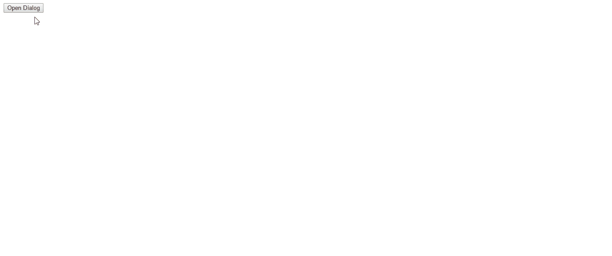

# node-study
## test dialog 

React component

## Install

#### Install node module package
```
$ cd test-dialog
$ npm install
```

## Compile and build
```
$ npm run build
```

#### You also can use this command
```
$ webpack
```

#### Build with press
```
$ webpack -p
```

## Develop
```
$ npm run dev
```

## Usage

#### Add new component to use the dialog component
```
//index.test.js

import React, { Component } from 'react';
import ReactDom from 'react-dom';
import Dialog from './components/Dialog';

// init a new Component
class Test extends Component {
  constructor(props) {
    super(props);

    // init state
    this.state = {
      show: false,
    };

    // bind 'this' 
    [
      'render',
      'handleOpen',
      'handleClose',
    ].forEach((method) => this[method] = this[method].bind(this));
  }

  // open dialog function
  handleOpen() {
    this.setState({
      show: true,
    });
  }

  // close dialog function
  handleClose() {
    this.setState({
      show: false,
    });
  }

  // render
  render() {
    return (
      <div>
        <button onClick={this.handleOpen}>Open Dialog</button>
        <Dialog show = {this.state.show} handleClose={this.handleClose}/>
      </div>
    );
  }
}

// do
ReactDom.render(
   <Test/>,
document.getElementById('example'));
```

#### Add react.js/react-dom.js in your html files
```
<!--example/index.html-->

<!DOCTYPE html>
<html lang="en">

<head>
  <meta charset="UTF-8">
  <title>Test dialog</title>
  <meta name="description" mc-content="test dialog" />

  <!-- Add react-with-addons.js and react-dom.js -->

  <script src="https://npmcdn.com/react@15.3.1/dist/react-with-addons.js"></script>
  <script src="https://npmcdn.com/react-dom@15.3.1/dist/react-dom.js"></script>
  <style>

    // set style

    .mc-dialog .mc-dialog-mask {
      position: fixed;
      z-index: 1400;
      top: 0;
      left: 0;
      width: 100%;
      height: 100%;
      background-color: rgba(0, 0, 0, .57);
    }

    .mc-dialog .mc-dialog-child {
      position: fixed;
      z-index: 1500;
      top: 0;
      left: 0;
      bottom: 0;
      right: 0;
      margin: auto;
      width: 75%;
      max-width: 768px;
      height: 30%;
    }

    .mc-dialog .mc-dialog-child .mc-content {
      width: auto;
      max-width: 768px;
      margin: 0px auto;
      background-color: #fff;
      box-shadow: rgba(0, 0, 0, 0.25) 0px 14px 45px, rgba(0, 0, 0, 0.22) 0px 10px 18px;
      border-radius: 2px;
    }

    .mc-dialog .mc-dialog-child .mc-content h3 {
      margin: 0px;
      padding: 24px 24px 20px;
      color: rgba(0, 0, 0, 0.87);
      font-size: 22px;
      line-height: 32px;
      font-weight: 400;
      border-bottom: 2px solid #ccc;
    }

    .mc-dialog .mc-dialog-child .mc-content p {
      font-size: 16px;
      color: rgba(0, 0, 0, 0.6);
      padding: 0px 24px 24px;
      box-sizing: border-box;
      overflow-y: hidden;
      max-height: 384px;
    }

    .mc-dialog .mc-dialog-child .mc-content div.mc-foot {
      box-sizing: border-box;
      -webkit-tap-highlight-color: rgba(0, 0, 0, 0);
      padding: 8px;
      width: 100%;
      text-align: right;
      margin-top: 0px;
      border-top: none;
    }

    .mc-dialog .mc-dialog-child .mc-content div.mc-foot .mc-btn.close {
      background-color: #fff;
      border-top: 2px solid #fff;
      border-left: 2px solid #fff;
      border-right: 2px solid #fff;
      border-bottom: 1px solid #ccc;
      padding: 8px;
      outline: none;
      transition: all .5s cubic-bezier(0.23, 1, 0.32, 1);
    }
    .mc-dialog .mc-dialog-child .mc-content div.mc-foot .mc-btn.close:hover {
      border-bottom: 1px solid #ee6e73;
    }

    .mc-dialog .mc-dialog-child .mc-content div.mc-foot .mc-btn.close:focus {
      border-bottom: 1px solid #ee6e73;
    }


    // add react animation style

    // mask animation
    .mc-dialog-mask-enter {
      background-color: rgba(0, 0, 0, 0);
      transition: all .5s cubic-bezier(0.23, 1, 0.32, 1);
    }

    .mc-dialog-mask-enter.mc-dialog-mask-enter-active {
      background-color: rgba(0, 0, 0, .57);
    }

    .mc-dialog-mask-leave {
      background-color: rgba(0, 0, 0, .57);
      transition: all .5s cubic-bezier(0.23, 1, 0.32, 1);
    }

    .mc-dialog-mask-leave.mc-dialog-mask-leave-active {
      background-color: rgba(0, 0, 0, 0);
    }


    // dialog child animation
    .mc-dialog-child-enter {
      opacity: 0;
      transform: translate(0px, -64px);
    }

    .mc-dialog-child-enter-active {
      opacity: 1;
      transform: translate(0px, 0);
      transition: all .5s cubic-bezier(0.23, 1, 0.32, 1);
    }

    .mc-dialog-child-leave {
      opacity: 1;
      transform: translate(0px, 0);
    }

    .mc-dialog-child-leave-active {
      opacity: 0;
      transform: translate(0px, -64px);
      transition: all .5s cubic-bezier(0.23, 1, 0.32, 1);
    }
  </style>
</head>

<body>
  <div id="example"></div>

  <!-- add Dialog.test.js -->

  <script src="http://localhost:3002/js/Dialog.test.js"></script>

</body>
</html>
```

## API

| Parameter        | Description                        | Type          | Default                  |
|------------------|------------------------------------|---------------|--------------------------|
| show             | is show the dialog                 | bool          |                          | 
| defaultShow      | default status                     | bool          | false                    | 
| classNamePrefix  | the prefix of the class            | string        | mc-dialog                | 
| isMaskOpen       | the mask component is show         | bool          | true                     | 
| handleClose      | close the dialog function          | func          | onChange                 | 
| handleOpen       | open the dialog function           | func          | onChange                 | 
| dialogTitle      | the title                          | string        |                          | 
| dialogCOntent    | the content                        | string        |                          | 
| style            | the dialog component style         | object        |                          | 
| className        | class                              | string        |                          | 

## 基于`React`实现的弹出层组件

本项目是使用`ECMAScript 2015`的语法,并基于`React`框架实现的分页组件.

### 最终效果如下



### 项目完整目录结构如下
```
├─dist
│  └─js
|         Dialog.js
|         Dialog.test.js
├─doc
│  └─img
|         dialog.gif
├─example
│         index.html
├─node_modules
├─src
|    └─components
|         Dialog.js
|         DialogChild.js
|         Mask.js
|    index.js
|    index.test.js
| .babelrc
| .eslintignore
| .eslintrc
| package.json
| README.md
| webpack.config.js
```

#### 目录结构说明

* dist: 存放编译好的js文件,由webpack配置生成
* doc/img: 存放文档资源文件
* example: 存放demo/实例文件
* node_modules: node依赖包,包含react/lodash/webpack等
* src: 项目开发目录
* src/components: 存放组件
* src/lib: 其他工具库
* src/index.js: 分页组件导出
* src/index.test.js: 分页组件demo实例
* .babelrc: babel编译工具配置文件
* .eslintignore: ESLint工具过滤器配置文件
* .eslintrc: ESLint工具配置文件
* webpack.config.js: webpack配置文件
* README.md: 项目说明文档
* package.json: 项目配置文件

### 用法

在`index.test.js`新建组件(类)
```
// 引入react.js\react-dom.js\Dialog
import React, { Component } from 'react';
import ReactDom from 'react-dom';
import Dialog from './components/Dialog';

// 初始化组件
class Test extends Component {

// 定义构造方法
  constructor(props) {
    super(props);

// 初始化状态
    this.state = {
      show: false,
    };

// 绑定父组件this对象
    [
      'render',
      'handleOpen',
      'handleClose',
    ].forEach((method) => this[method] = this[method].bind(this));
  }

// 打开弹出层方法
  handleOpen() {
    this.setState({
      show: true,
    });
  }

// 关闭弹出层方法
  handleClose() {
    this.setState({
      show: false,
    });
  }

// 渲染(导出)组件,当点击按钮时触发显示弹出层,请注意为按钮绑定点击事件
  render() {
    return (
      <div>
        <button onClick={this.handleOpen}>Open Dialog</button>
        <Dialog show = {this.state.show} handleClose={this.handleClose}/>
      </div>
    );
  }
}

// 将最终组件渲染至页面
ReactDom.render(
   <Test/>,
document.getElementById('example'));
```

在`examole/index.html`中引入组件,编写组件样式等
```
<!DOCTYPE html>
<html lang="en">

<head>
  <meta charset="UTF-8">
  <title>Test dialog</title>
  <meta name="description" mc-content="test dialog" />

<!-- 引入react-with-addons.js and react-dom.js -->

  <script src="https://npmcdn.com/react@15.3.1/dist/react-with-addons.js"></script>
  <script src="https://npmcdn.com/react-dom@15.3.1/dist/react-dom.js"></script>
  <style>

    // 设置组件样式

    .mc-dialog .mc-dialog-mask {
      position: fixed;
      z-index: 1400;
      top: 0;
      left: 0;
      width: 100%;
      height: 100%;
      background-color: rgba(0, 0, 0, .57);
    }

    .mc-dialog .mc-dialog-child {
      position: fixed;
      z-index: 1500;
      top: 0;
      left: 0;
      bottom: 0;
      right: 0;
      margin: auto;
      width: 75%;
      max-width: 768px;
      height: 30%;
    }

    .mc-dialog .mc-dialog-child .mc-content {
      width: auto;
      max-width: 768px;
      margin: 0px auto;
      background-color: #fff;
      box-shadow: rgba(0, 0, 0, 0.25) 0px 14px 45px, rgba(0, 0, 0, 0.22) 0px 10px 18px;
      border-radius: 2px;
    }

    .mc-dialog .mc-dialog-child .mc-content h3 {
      margin: 0px;
      padding: 24px 24px 20px;
      color: rgba(0, 0, 0, 0.87);
      font-size: 22px;
      line-height: 32px;
      font-weight: 400;
      border-bottom: 2px solid #ccc;
    }

    .mc-dialog .mc-dialog-child .mc-content p {
      font-size: 16px;
      color: rgba(0, 0, 0, 0.6);
      padding: 0px 24px 24px;
      box-sizing: border-box;
      overflow-y: hidden;
      max-height: 384px;
    }

    .mc-dialog .mc-dialog-child .mc-content div.mc-foot {
      box-sizing: border-box;
      -webkit-tap-highlight-color: rgba(0, 0, 0, 0);
      padding: 8px;
      width: 100%;
      text-align: right;
      margin-top: 0px;
      border-top: none;
    }

    .mc-dialog .mc-dialog-child .mc-content div.mc-foot .mc-btn.close {
      background-color: #fff;
      border-top: 2px solid #fff;
      border-left: 2px solid #fff;
      border-right: 2px solid #fff;
      border-bottom: 1px solid #ccc;
      padding: 8px;
      outline: none;
      transition: all .5s cubic-bezier(0.23, 1, 0.32, 1);
    }
    .mc-dialog .mc-dialog-child .mc-content div.mc-foot .mc-btn.close:hover {
      border-bottom: 1px solid #ee6e73;
    }

    .mc-dialog .mc-dialog-child .mc-content div.mc-foot .mc-btn.close:focus {
      border-bottom: 1px solid #ee6e73;
    }


    // 创建react动画样式

    // 遮罩层动画
    .mc-dialog-mask-enter {
      background-color: rgba(0, 0, 0, 0);
      transition: all .5s cubic-bezier(0.23, 1, 0.32, 1);
    }

    .mc-dialog-mask-enter.mc-dialog-mask-enter-active {
      background-color: rgba(0, 0, 0, .57);
    }

    .mc-dialog-mask-leave {
      background-color: rgba(0, 0, 0, .57);
      transition: all .5s cubic-bezier(0.23, 1, 0.32, 1);
    }

    .mc-dialog-mask-leave.mc-dialog-mask-leave-active {
      background-color: rgba(0, 0, 0, 0);
    }


    // 弹出层主体动画
    .mc-dialog-child-enter {
      opacity: 0;
      transform: translate(0px, -64px);
    }

    .mc-dialog-child-enter-active {
      opacity: 1;
      transform: translate(0px, 0);
      transition: all .5s cubic-bezier(0.23, 1, 0.32, 1);
    }

    .mc-dialog-child-leave {
      opacity: 1;
      transform: translate(0px, 0);
    }

    .mc-dialog-child-leave-active {
      opacity: 0;
      transform: translate(0px, -64px);
      transition: all .5s cubic-bezier(0.23, 1, 0.32, 1);
    }
  </style>
</head>

<body>
  <div id="example"></div>

  <!-- 引入Dialog.test.js(编译好的) -->

  <script src="http://localhost:3002/js/Dialog.test.js"></script>

</body>
</html>
```

### API

| Parameter        | Description                        | Type          | Default                  |
|------------------|------------------------------------|---------------|--------------------------|
| show             | 是否显示弹出层                      | bool          |                          | 
| defaultShow      | 默认是否显示弹出层                   | bool          | false                    | 
| classNamePrefix  | class属性前缀                       | string        | mc-dialog                | 
| isMaskOpen       | 是否显示遮罩                        | bool          | true                     | 
| handleClose      | 关闭弹出层                          | func          | onChange                 | 
| handleOpen       | 打开弹出层                          | func          | onChange                 | 
| dialogTitle      | 弹出层标题                          | string        |                          | 
| dialogCOntent    | 弹出层内容                          | string        |                          | 
| style            | 弹出层样式                          | object        |                          | 
| className        | 弹出层class属性                     | string        |                          | 

## 实现原理

接下来的是具体的实现过程

### 准备

本项目主要基于`node.js`,由于使用`ECMAScript 2015`语法,所以需要`babel/webpack`等工具编译/压缩;用`ESLint`等工具进行语法检查和校验,所以再进行下一步操作之前,请确保系统含有`node.js`环境

#### 配置node.js环境
在本项目中需要
```
node.js v6.0+
npm v3.0+
```

`node.js`下载地址:
```
https://nodejs.org/en/
```

#### 全局安装webpack工具(可选)
建议进行全局安装`webpack`工具
```
$ npm install webpack -g
```

### 初始化和配置项目

搭建基于node.js的项目和项目开发环境

#### 初始化

##### 新建项目目录
```
$ mkdir test-dialog
```

##### 切换至项目目录下并初始化项目
```
$ cd test-dialog
$ npm init
```

##### 填写项目配置`package.json`,请注意不可忽略的选项
```
name: (test-dialog) //项目名称,可忽略
version: (1.0.0) //项目版本,可忽略
description: A dialog component base on React // 项目描述,可忽略
entry point: (index.js) // 默认入口文件,可忽略
test command: // 测试用命令,可忽略
git repository: //git仓库,可忽略
keywords: // 可忽略
author: Jun // 作者
license: (ISC) // 开源协议,可忽略
```

> 至此完成`package.json`初始化配置

##### 配置清单如下
```
{
  "name": "test-dialog",
  "version": "1.0.0",
  "description": "",
  "main": "index.js",
  "scripts": {
    "test": "echo \"Error: no test specified\" && exit 1"
  },
  "keywords": [
    "dialog",
    "react"
  ],
  "author": "Jun",
  "license": "ISC"
}
```

#### 配置`package.json`及配置项目开发环境

##### 加入`React`依赖包
```
"dependencies": {
  "lodash": "4.16.4",
  "react": "15.2.1",
  "react-dom": "15.2.1",
  "react-addons-css-transition-group": "^15.2.1",
}
```

##### 加入`webpack`工具
```
"devDependencies": {
  "extract-text-webpack-plugin": "~0.8.2",
  "webpack": "^1.7.3",
  "webpack-dev-server": "^1.16.2"
}
```

##### 由于需要使用`ES6`语法编写,加入`babel`编译工具
```
"devDependencies": {
  "babel-core": "^6.5.2",
  "babel-eslint": "^4.1.8",
  "babel-loader": "^6.2.2",
  "babel-plugin-add-module-exports": "^0.1.2",
  "babel-plugin-transform-runtime": "^6.15.0",
  "babel-preset-es2015": "^6.18.0",
  "babel-preset-es2015-ie": "6.x",
  "babel-preset-react": "^6.3.13",
  "babel-preset-stage-1": "^6.16.0",
  "babel-register": "^6.18.0",
  "extract-text-webpack-plugin": "~0.8.2",
  "webpack": "^1.7.3",
  "webpack-dev-server": "^1.16.2"
}
```

##### 加入代码校验工具`ESLint`
```
"devDependencies": {
  "babel-core": "^6.5.2",
  "babel-eslint": "^4.1.8",
  "babel-loader": "^6.2.2",
  "babel-plugin-add-module-exports": "^0.1.2",
  "babel-plugin-transform-runtime": "^6.15.0",
  "babel-preset-es2015": "^6.18.0",
  "babel-preset-es2015-ie": "6.x",
  "babel-preset-react": "^6.3.13",
  "babel-preset-stage-1": "^6.16.0",
  "babel-register": "^6.18.0",
  "eslint": "^1.10.3",
  "eslint-config-airbnb": "^5.0.1",
  "eslint-loader": "^1.6.3",
  "eslint-plugin-react": "^3.16.1",
  "extract-text-webpack-plugin": "~0.8.2",
  "webpack": "^1.7.3",
  "webpack-dev-server": "^1.16.2"
}
```

##### 配置`webpack` `build`命令和`webpack-dev-server`开发环境,可用于实时调试和热部署项目
```
"scripts": {
  "test": "echo \"Error: no test specified\" && exit 1",
  "dev": "webpack-dev-server --devtool eval --progress --colors --open --hot --content-base ./example",
  "build": "webpack -p --colors"
}
```

> 在本项目中会用到的`webpack/webpack-dev-server`命令说明

  `webpack`

  | Command          | Description                                                                        |
  |------------------|------------------------------------------------------------------------------------|
  | webpack          | 主命令：执行编译/混合/CSS样式,开发模式,代码未压缩处理,并包含webpack相关编译代码  |
  | -p               | 主命令：执行编译/压缩/混合/CSS样式,不包含webpack相关编译代码  |
  | -w               | 执行编译/混合/CSS样式,开发模式,实时监听代码变化,并进行编译/压缩/混合等一系列热部署操作  |
  | -p --color       | 主命令：执行编译/压缩/混合/CSS样式,不包含webpack相关编译代码,并高亮显示控制台输出结果  |
  | -h               | 查看更多webpack命令  |


  `webpack-dev-server`

  | Command        | Description                        |
  |------------------|------------------------------------|
  | webpack-dev-server| 主命令：启动`webpack`开发调试服务  |
  | --devtool eval | 启用开发者模式,编译后代码包含`sourcemap`等信息,可用于浏览器进行调试  |
  | --progress          | 显示`webpack` `building`进度  |
  | --colors          | 高亮显示控制台输出结果  |
  | --open          | 浏览器自动刷新  |
  | --hot          | `webpack`服务实时监听  |
  | --content-base ./example | `webpack`服务启动入口`html`文件目录设置,例如`example`目录  |

> 至此`package.json`配置完成,在之后的开发中如果需要其他配置和依赖包,可按照如上步骤

##### 完整`package.json`清单
```
{
  "name": "test-dialog",
  "version": "0.0.1",
  "description": "react dialog",
  "main": "index.js",
  "scripts": {
    "test": "echo \"Error: no test specified\" && exit 1",
    "dev": "webpack-dev-server --devtool eval --progress --colors --open --hot --content-base ./example",
    "build": "webpack -p --colors"
  },
  "keywords": [
    "react",
    "dialog"
  ],
  "author": "Jun",
  "license": "ISC",
  "devDependencies": {
    "babel-core": "^6.5.2",
    "babel-eslint": "^4.1.8",
    "babel-loader": "^6.2.2",
    "babel-plugin-add-module-exports": "^0.1.2",
    "babel-plugin-transform-runtime": "^6.15.0",
    "babel-preset-es2015": "^6.18.0",
    "babel-preset-es2015-ie": "6.x",
    "babel-preset-react": "^6.3.13",
    "babel-preset-stage-1": "^6.16.0",
    "babel-register": "^6.18.0",
    "eslint": "^1.10.3",
    "eslint-config-airbnb": "^5.0.1",
    "eslint-loader": "^1.6.3",
    "eslint-plugin-react": "^3.16.1",
    "extract-text-webpack-plugin": "~0.8.2",
    "webpack": "^1.7.3",
    "webpack-dev-server": "^1.16.2"
  },
  "dependencies": {
    "lodash": "4.16.4",
    "react": "15.2.1",
    "react-dom": "15.2.1",
    "react-addons-css-transition-group": "^15.2.1",
  }
}
```

##### 安装node.js依赖包

安装上面配置好的依赖包(这一步执行完毕,才能继续下面的操作否则`ESLint`等工具会提示报错)
```
$ npm install
```

#### 配置编译工具babel

##### 如果`.babelrc`文件不存在,则新建,配置清单如下
```
{
    "presets": [
        "es2015",
        "react"
    ],
    "plugins": [
        "transform-runtime"
    ]
}
```

#### 配置eslintignore

由于并不需要让`babel`编译依赖包目录`node_modules`,所以需要进行配置,新建`.eslintignore`文件,配置如下
```
node_modules
```

#### 配置语法检查工具eslint

按照`ECMAScript 2015`标准对语法进行检验,在这里我们使用`Airbnb`的`eclint`的规则,在前面的`package.json`中已加入依赖包;新建`.eslintrc`

##### 配置清单如下
```
{
    "env": {
    "node": true,
    "es6": true,
    "browser": true
  },
  "parser": "babel-eslint",
  "extends": "airbnb",
  "rules": {
    "no-var": [
      0
    ],
    "no-console": 1,
    "no-unused-vars":1,
    "no-param-reassign":1,
    "react/jsx-no-bind":1
  }
}
```

### webpack配置（项目构建）

如果完成前面的项目初始化配置,接下来可以配置webpack清单,

#### 配置webpack

##### 初始化

引入`node` `path`模块,用于获取文件路径 
引入`ExtractTextPlugin`外部加载文件插件
初始化`node`依赖包路径
```
const path = require('path');
const ExtractTextPlugin = require('extract-text-webpack-plugin');
const nodeModulesPath = path.resolve(__dirname, 'node_modules');
```

> 这里使用`ECMAScript 2015`不可随意修改的变量类型`const`,具有块级作用域的作用,可避免`var`声明的变量存在变量提升和随意修改的问题 

在这里使用`module.export`输出配置
```
module.exports = {
  //webpack配置清单
}
```

设置`devtool`属性为`false`,在`webpack`打包时不生成`sourcemap`信息,
```
module.exports = {
  devtool: false
}
```

##### 模块和插件配置

配置`ESLint`预加载,用于语法检查
```
module: {
  preLoaders: [
    {
      // ESlint loader
      test: /\.(js|jsx)$/,
      loader: 'eslint-loader',
      include: [path.resolve(__dirname, 'src')],
      exclude: [nodeModulesPath],
    },
  ]
}
```

配置加载模块插件,在本项目中仅编译`js`所以仅加载`js`的编译工具,同时排除`node`依赖包的编译,且使用`babel`;在之后会补充`css/sass`模块插件
```
module: {
  preLoaders: [
    {
      // ESlint loader
      test: /\.(js|jsx)$/,
      loader: 'eslint-loader',
      include: [path.resolve(__dirname, 'src')],
      exclude: [nodeModulesPath],
    },
  ],
  loaders: [
    { 
      test: /\.js?$/,
      exclude: /node_modules/,
      loader: 'babel',
    },
  ]
}
```

为了便于更好的扩展性,且同时编译`react/react-dom`,生成的文件会很大,比较消耗资源,在页面中加载数MB的`js`文件并不理想,所以在这里进行如下配置,可以将`react/react-dom`通过`CDN`依赖等外部引入的方式加载至页面
```
externals: {    // 指定采用外部 CDN 依赖的资源,不被webpack打包
  react: 'React',
  'react-dom': 'ReactDOM',
}
```

`webpack-dev-server`也可以在这里配置,包括服务监听端口号
```
devServer: {
  hot: true,
  inline: true, // webpack-dev-server有两种模式,默认是false,即在页面中加入frame标签构建调试页面;若为true则是在完整页面中构建调试页面
  progress: true,
  port: '3001',
}
```

加载`ESLint`配置文件,由于上面进行`ESLint`模块预加载,在这里需要加入`ESLint`配置文件
```
eslint: {
  configFile: '.eslintrc',
}
```

#### 完整`webpack`清单如下
```
const path = require('path');
const ExtractTextPlugin = require('extract-text-webpack-plugin');
const nodeModulesPath = path.resolve(__dirname, 'node_modules');

module.exports = {
  devtool: false,
  entry: {
    'dialog.test': path.join(__dirname, 'src', 'index.test.js'),
    dialog: path.join(__dirname, 'src', 'index.js'),
  },

  output: {
    path: path.join(__dirname, 'dist'),
    publicPath: '',
    filename: 'js/[name].js',
    chunkFilename: 'js/[id].chunk.js',
  },
  module: {
    preLoaders: [
      {
        // ESLint loader
        test: /\.(js|jsx)$/,
        loader: 'eslint-loader',
        include: [path.resolve(__dirname, 'src')],
        exclude: [nodeModulesPath],
      },
    ],
    loaders: [
      {
        test: /\.js?$/,
        exclude: /node_modules/,
        loader: 'babel',
      },
    ],
  },
  externals: {    // 指定采用外部 CDN 依赖的资源,不被webpack打包
    react: 'React',
    'react-dom': 'ReactDOM',
  },
  devServer: {
    hot: true,
    inline: true,
    progress: true,
    port: '3001',
  },
  eslint: {
    configFile: '.eslintrc',
  },
};
```
> 配置好`webpack`清单,基本上可以执行`webpack`相关命令了

### 组件具体实现

本项目实现的弹出层组件由多个子组件组成,目前仅实现了基础子组件,之后会不断完善

| Component        | Description                        |
|------------------|------------------------------------|
| Dialog           | 弹出层组件主体                      |
| DialogChild      | 弹出层组件子结构                     |
| Mask             | 弹出层组件遮罩层                     |

#### 实现`Mask`组件

弹出层有一个遮罩层,可避免误操作,同时点击遮罩层可关闭弹出层

##### 引入React
```
import React, { Component } from 'react';
```

##### 定义`Mask`类,并继承React的Component父类
```
class Mask extends Component {

}
```

##### 定义构造方法以继承`this`对象
```
class Mask extends Component {
  constructor(props) {
    super(props);
  }
}
```

##### 定义`Mask`类`propTypes`属性
```
Mask.propTypes = {
  className: React.PropTypes.string, //Mask组件class属性
  handleChange: React.PropTypes.func, // Mask组件点击事件
};
```

##### 设定`propTypes`属性默认值
```
Mask.defaultProps = {
  className: 'mc-mask',
};
```

##### 定义`reader`方法,并初始化变量
```
render() {
  const props = this.props;
}
```

##### 实现点击事件钩子函数`_handleChange`
```
_handleChange() {
    this.props.handleChange(); // 这里由上层父组件传递事件函数至Mask组件
  }
```

##### 接下来实现`Mask`组件`render`返回值,即`Mask`组件主体,并设置点击事件
```
render() {
    const props = this.props;
    // 组装className属性;style属性;点击事件
    return (
        <div
          className = {`${props.rootClassNamePrefix}-mask ` +
          `${props.className}`}
          style={props.style}
          onClick = {this._handleChange}
        ></div>
    );
  }
```

##### 为`render`方法和`_handleChange`方法绑定`this`对象
```
class Mask extends Component {
  constructor(props) {
    super(props);

    [
      'render',
      '_handleChange',
    ].forEach((method) => this[method] = this[method].bind(this));
  }

  // ...

}
```

##### 导出组件
```
export default Mask;
```

> 至此`Mask`组件实现,用法请看在下面`Dialog`组件的中用法,API请看下面

##### `Mask`组件API

| Parameter        | Description                        | Type          | Default                  |
|------------------|------------------------------------|---------------|--------------------------|
| className        | class属性                          | string         | mc-mask                 |
| handleChange     | 点击事件钩子函数(可关闭或打开Mask组件)  | func        |                         |
| style            | 组件样式                            | object         |                        |

#### 实现`DialogChild`组件

弹出层主体组件,包含组件具体内容,可通过传入子组件实现多种不同功能的弹出层,即使用React.Children.map方法,详细如下

##### 引入React
```
import React, { Component } from 'react';
```

##### 定义`DialogChild`类,并继承React的Component父类
```
class DialogChild extends Component {

}
```

##### 定义构造方法以继承`this`对象
```
class DialogChild extends Component {
  constructor(props) {
    super(props);
  }
}
```

##### 定义`DialogChild`类`propTypes`属性
```
Mask.propTypes = {
  className: React.PropTypes.string, // Mask组件class属性
  handleChange: React.PropTypes.func, // Mask组件点击事件
  content: React.PropTypes.string, // 若外部未引入自定义子组件,则启用默认组件,这里是设置默认组件的内容信息
  title: React.PropTypes.string, // 若外部未引入自定义子组件,则启用默认组件,这里是设置默认组件的标题信息 
};
```

##### 设定`propTypes`属性默认值
```
Mask.defaultProps = {
  content: 'Title', // 默认标题
  title: 'This is content', // 默认内容
};
```

##### 定义`reader`方法,并初始化变量
```
render() {
  const props = this.props;
  const preFix = `${props.rootClassNamePrefix}-child`;
}
```

##### 设置子组件,这里引入`reatc` `this.props.children`

如果未定义子组件,则设置默认子组件,并组装class
```
const children = (
  <div className={`${preFix}-content mc-content`}>
    <h3>{props.title}</h3>
    <p>{props.content}</p>
    <div className={`${preFix}-foot mc-foot`}>
      <button 
        className={`${preFix}-btn mc-btn close`}
        onClick={props.handleChange}
      >
        OK
      </button>
    </div>
  </div>
);
```

否则使用自定义子组件,clone
```
const children = (React.Children.map(props.children, (child) => React.cloneElement(child))); 
```

> `React.Children.map`可以获取和遍历子组件,返回组件数组;
> `React.cloneElement` `clone`自定义子组件并返回组件数组;
> 请注意在这里使用了箭头函数

整理代码
```
const children = (('children' in props) && props.children !== undefined) ? (React.Children.map(props.children, (child) => React.cloneElement(child))) :
      (<div className={`${preFix}-content mc-content`}>
        <h3>{props.title}</h3>
          <p>{props.content}</p>
          <div className={`${preFix}-foot mc-foot`}>
            <button className={`${preFix}-btn mc-btn close`}
              onClick={props.handleChange}
            >
              OK
            </button>
          </div>
        </div>
      );
```

##### 接下来实现`DialogChild`组件`render`返回值,即`DialogChild`组件主体,并组装上面完成的子组件
```
return (
  <div
    className = {`${preFix} ${('className' in props) ? props.className : ''} `}
    style={props.style}
  >
    {children}
  </div>
);
```

##### 为`render`方法绑定`this`对象
```
class DialogChild extends Component {
  constructor(props) {
    super(props);

    [
      'render',
    ].forEach((method) => this[method] = this[method].bind(this));
  }

  // ...

}
```

##### 导出组件
```
export default DialogChild;
```

> 至此`DialogChild`组件实现,用法请看在下面`Dialog`组件的中用法,API请看下面

##### `DialogChild`组件API

| Parameter        | Description                        | Type          | Default                  |
|------------------|------------------------------------|---------------|--------------------------|
| className        | class属性                          | string         |                         |
| handleChange     | 点击事件钩子函数(可关闭或打开Mask组件)  | func        |                         |
| style            | 组件样式                            | object         |                        |
| content          | 组件的内容信息                       | string         | Title                  |
| title            | 组件的标题信息                       | string         | This is content        |


#### 实现`Dialog`组件

弹出层组件主体,涉及点击事件,子组件方法传递,组件动画效果,组件复用性和可扩展性等

##### 定义`Dialog`类,并继承React的Component父类
```
class Dialog extends Component {

}
```

##### 定义构造方法以继承`this`对象
```
class Dialog extends Component {
  constructor(props) {
    super(props);
  }
}
```

##### 定义`Dialog`类`propTypes`属性
```
Dialog.propTypes = {
  className: React.PropTypes.string, // Mask组件class属性
  show: React.PropTypes.bool, // 是否打开弹出层
  defaultShow: React.PropTypes.bool, // 默认弹出层是否打开
  classNamePrefix: React.PropTypes.string, // 弹出层class前缀
  isMaskOpen: React.PropTypes.bool, // 是否显示遮罩
  handleClose: React.PropTypes.func, // 关闭弹出层钩子函数
  handleOpen: React.PropTypes.func, // 打开弹出层钩子函数
  dialogTitle: React.PropTypes.string, // 弹出层标题,传入DialogChild组件
  dialogCOntent: React.PropTypes.string, // 弹出层内容,传入DialogChild组件
  style: React.PropTypes.object, // 组件样式
};
```

##### `React.PropTypes.func`类型的属性默认值不能为空,所以需要初始化一个无操作无返回值的函数
```
function onChange() {
}
```

##### 设定`propTypes`属性默认值
```
Dialog.defaultProps = {
  defaultShow: false,
  classNamePrefix: 'mc-dialog',
  isMaskOpen: true, // 遮罩层默认开启
  handleClose: onChange,
  handleOpen: onChange,
};
```

##### 实现打开/关闭弹出层钩子函数

打开弹出层
```
_handleOpen() {
    if ('handleOpen' in this.props) {
      this.props.handleOpen(); // 开放API接口
    } else {
      this.setState({ show: true }); // 改变状态
    }
  }
```

关闭弹出层
```
_handleClose() {
    if ('handleClose' in this.props) {
      this.props.handleClose();
    } else {
      this.setState({ show: false });
    }
  }
```

##### 处理接口和状态

初始化`props.show`接口
```
class Dialog extends Component {
  constructor(props) {
    super(props);
    let show = this.props.defaultShow; // 初始化默认值

    if ('show' in props) {
      show = this.props.show;
    }
  }
}
```

设置状态
```
class Dialog extends Component {
  constructor(props) {
    super(props);
    let show = this.props.defaultShow; // 初始化默认值

    if ('show' in props) {
      show = this.props.show;
    }

    this.state = {
      show,
      _show: show,
    };
  }
}
```

##### 处理组件生命周期

当组件重新`render`前,`this.props.show`接收到新的值时,改变状态
```
componentWillReceiveProps(nextProps) {
  if ('show' in nextProps) {
    this.setState({
      show: nextProps.show,
    });
  }
}
```

> 请注意当外部复用`Dialog`组件时,只有配置`show`,且时已经改变的状态值才能触发该生命周期函数,即
> ```
> show = {this.state.show}
> ```

##### 为钩子函数和`render`方法绑定`this`对象
```
class Dialog extends Component {
  constructor(props) {
    super(props);
  
  // ...

    [
      'render',
      '_handleClose',
      '_handleOpen',
    ].forEach((method) => this[method] = this[method].bind(this));

  }
}
```

##### 在`render`方法里初始化变量并组装组件

初始化
```
render() {
  const props = this.props;
  const _state = this.state;
  let mask = null;
  let dialogChild = null;
}
```

如果当前状态`show`为`true`显示弹出层主体组件`DialogChild`
```
if (_state.show) {
  dialogChild = (
    <DialogChild
      rootClassNamePrefix = {`${props.classNamePrefix}`}
      handleChange = {this._handleClose}
      title = {props.dialogTitle}
      content = {props.dialogCOntent}
    >

    </DialogChild>
}
```

往`DialogChild`装入子组件`props.children`,使用`React.Children.map`获取和遍历子组件,用`React.cloneElement` `clone`和重新渲染子组件,并为子组件设置`key`标识符
```
if (_state.show) {
  dialogChild = (
    <DialogChild
      rootClassNamePrefix = {`${props.classNamePrefix}`}
      handleChange = {this._handleClose}
      title = {props.dialogTitle}
      content = {props.dialogCOntent}
    >
      {
        React.Children.map(props.children, (child, i) =>
          React.cloneElement(child, {
            key: i,
        }))
      }
    </DialogChild>
}
```

如果`props.isMaskOpen`为`true`则启用遮罩层`Mask`组件
```
if (_state.show) {

  // ...

  if (props.isMaskOpen) {
    mask = (
      <Mask
        rootClassNamePrefix = {`${props.classNamePrefix}`}
        handleChange = {this._handleClose}
      />
    );
  }
}
```

##### 装载动画效果

在这里需要引入使用含插件版本的`react.js`,使用`react`动画组件`ReactCSSTransitionGroup`
```
<ReactCSSTransitionGroup
  component="div" // 渲染组件类型
  transitionName="mc-dialog-child" // 动画效果class前缀,(动画效果类)
  transitionEnterTimeout={500} // 动画效果时间
  transitionLeaveTimeout={500}
>
  {dialogChild}  // 装载需要展示动画效果的组件
</ReactCSSTransitionGroup>
```

请注意定义了动画类(class前缀),需要在外部定义对应的css属性
```
<style>
  // index.html

  // 进入DOM时装载class
  .mc-dialog-child-enter {
    opacity: 0;
    transform: translate(0px, -64px);
  }

  // 进入DOM时处于active状态装载css
  .mc-dialog-child-enter-active {
    opacity: 1;
    transform: translate(0px, 0);
    transition: all .5s cubic-bezier(0.23, 1, 0.32, 1);
  }

  // 离开DOM时装载class
  .mc-dialog-child-leave {
    opacity: 1;
    transform: translate(0px, 0);
  }

  // 离开DOM时处于active状态装载css
  .mc-dialog-child-leave-active {
    opacity: 0;
    transform: translate(0px, -64px);
    transition: all .5s cubic-bezier(0.23, 1, 0.32, 1);
  }
</style>
```

为`Mask`组件同样装载动画,并定义动画类(class)
```
<ReactCSSTransitionGroup
  component="div"
  transitionName="mc-dialog-mask"
  transitionEnterTimeout={500}
  transitionLeaveTimeout={500}
>
  {mask}
</ReactCSSTransitionGroup>
```

```
.mc-dialog-mask-enter {
  background-color: rgba(0, 0, 0, 0);
  transition: all .5s cubic-bezier(0.23, 1, 0.32, 1);
}

.mc-dialog-mask-enter.mc-dialog-mask-enter-active {
  background-color: rgba(0, 0, 0, .57);
}

.mc-dialog-mask-leave {
  background-color: rgba(0, 0, 0, .57);
  transition: all .5s cubic-bezier(0.23, 1, 0.32, 1);
}

.mc-dialog-mask-leave.mc-dialog-mask-leave-active {
  background-color: rgba(0, 0, 0, 0);
}
```

##### 导出组件
```
export default Dialog;
```

> 至此`Dialog`组件完成,接下来按照上面的用法和webpack相关用法即可运行查看实际效果

##### `Dialog`组件API

| Parameter        | Description                        | Type          | Default                  |
|------------------|------------------------------------|---------------|--------------------------|
| show             | 是否显示弹出层                      | bool          |                          | 
| defaultShow      | 默认是否显示弹出层                   | bool          | false                    | 
| classNamePrefix  | class属性前缀                       | string        | mc-dialog                | 
| isMaskOpen       | 是否显示遮罩                        | bool          | true                     | 
| handleClose      | 关闭弹出层                          | func          | onChange                 | 
| handleOpen       | 打开弹出层                          | func          | onChange                 | 
| dialogTitle      | 弹出层标题                          | string        |                          | 
| dialogCOntent    | 弹出层内容                          | string        |                          | 
| style            | 弹出层样式                          | object        |                          | 
| className        | 弹出层class属性                     | string        |                          | 

#### 关于ESLint

`ESLint` 是一个开源的 `JavaScript` 代码检查工具.代码检查是一种静态的分析,常用于寻找有问题的模式或者代码,并且不依赖于具体的编码风格。对大多数编程语言来说都会有代码检查,一般来说编译程序会内置检查工具。

`JavaScript` 是一个动态的弱类型语言,在开发中比较容易出错。且是实时编译,为了改变开发方式,提升开发效率,需要一种语法检查工具.

`ESLint` 为了让开发者可以创建自己的检测规则,所有规则都被设计成可插入的。`ESLint` 的默认规则与其他的插件无太大区别,规则本身和测试可以依赖于同样的模式。在项目中可以使用`ESLint` 内置规则,也可以在使用过程中自定义规则。

`ESLint`是基于`Node.js`,使用node.js安装部署。

所有规则都是可拔插的

* 内置规则和自定义规则共用一套规则 API
* 内置的格式化方法和自定义的格式化方法共用一套格式化 API
* 额外的规则和格式化方法能够在运行时指定
* 规则和对应的格式化方法并不强制捆绑使用

每条规则:

* 各自独立
* 可以开启或关闭
* 可以将结果设置成警告或者错误
* ESLint 规则可根据需要自由定制
* 所有内置规则都是泛化的
* 在本项目中使用Airbnb规则

关于`eslint-config-airbnb`规则

`eslint-config-airbnb`规则是Airbnb公司开源的基于`ESLint`的规则,使用起来较为方便,且可以更好的保持代码风格一致性,可读性,可维护性

#### 关于ECMAScript

ECMAScript 的第六版修订,于 2015 年完成标准化.这个标准被部分实现于大部分现代浏览器.

在本项目使用了ECMAScript 2015规范中的语法,并使用babel工具进行编译,以便于在大部分浏览器中能够稳定运行.

#### 关于babel

Babel是一个广泛使用的转码器,可以将ECMAScript 2015(ECMAScript 6)代码转为ECMAScript 5代码,从而在现有环境执行.

#### 在本项目中用到的一些语法特性

>`const\let` 用法

> 不同于`var`,`const/let`更加严格,具有块级作用域性质;可以避免`var`变量提升,局部变量不可控等一系列问题,例如
  ```
  // ES6
  let sum=0;
  for(let i=0; i<5;i++){
    sum+=i;
  }
  console.log('sum = '+sum);
  console.log('i = '+i)

  // error

  // Uncaught SyntaxError: Identifier 'sum' has already been declared
  ```

  ```
  // ES6
  const sum = 1;
  console.log(sum);

  // error
  // Uncaught SyntaxError: Identifier 'sum' has already been declared
  ```
> babel编译后  
  ```
  // ES5
  var sum=0;
  for(var i=0; i<5;i++){
    sum+=i;
  }
  console.log('sum = '+sum);
  console.log('i = '+i)

  // sum = 10
  // i = 5
  ```

> 箭头函数用法
  ```
  // ES6
  let f = v => v;
  ```
> babel编译后  
  ```
  "use strict";

  var f = function f(v) {
    return v;
  };
  ```

> class\extends\constructor\super用法
  
> JavaScript语言的传统方法是通过构造函数,定义并生成新对象,例如
  ```
  function test(value){
   this.value = value
  }
  test.prototype.testFunc = function () {
   console.log(this.value);
  }
  var t = new test(1);
  ```
> 使用class
  ```
  class test{
   constructor(value){
     this.value = value
   }
   testFunc = function () {
     console.log(this.value);
   }
  }
  ```  
> `class`之间可以通过`extends`关键字实现继承,这比ES5的通过修改原型链实现继承,要清晰和方便很多,例如在本项目中继承react的Component类
  ```
  class dialog extends React.Component {
  
  }
  ```  
> 用`super`继承父类`this`,但是创造父类的实例对象`this`(所以必须先调用`super`方法),然后再用子类构造函数修改`this`

> import/export模块功能用法

> 模块功能主要由两个命令构成:export和import。export命令用于规定模块的对外接口,import命令用于输入他模块提供的功能

> 一个模块就是一个独立的文件,该文件内部的所有变量,外部无法获取.如果希望外部能够读取模块内部的某个变量/方法/类等,就必须使用export关键字输出
  ```
  var firstName = 'Michael';
  var lastName = 'Jackson';
  var year = 1958;

  export {firstName, lastName, year};
  ```
> 指定模块输出`export default`  

> 使用export命令定义了模块的对外接口以后,其他 JS 文件就可以通过import命令加载这个模块.
  ```
  import { stat, exists, readFile } from 'fs'; // 引入node 内置fs模块
  ```

> import命令接受一对大括号,里面指定要从其他模块导入的变量名.大括号里面的变量名,必须与被导入模块对外接口的名称相同

> 如果想为输入的变量重新取一个名字,import命令要使用as关键字,将输入的变量重命名
  ```
  import { rf as readFile } from 'fs';
  ```

> 字符串模板
使用 两个反引号\`包裹字符串
```
`Hello world`
```

使用`${}`包裹需要嵌入字符串模板的变量
```
let number = 111
let str = `the number is ${number}`
console.log(str);

// the number is 111
```

#### 关于React
React是一个为数据提供渲染, HTML的视图的开源 JavaScript 库.React视图通常采用包含以自定义HTML 标记规定的其他组件的组件渲染.React 为开发者提供了一种子组件不能直接影响外层组件 ("data flows down") 的模型,数据改变时对HTML文档的有效更新,和现代单页应用中组件之间干净的分离  

React提出了虚拟DOM的概念(virtual DOM)即React组件并不是真实的DOM节点,而是存在于内存之中的一种数据结构.只有当它插入文档以后,才会变成真实的DOM.根据React的设计,所有的DOM变动,都先在虚拟DOM上发生,然后再将实际发生变动的部分,反映在真实DOM上,这种算法叫做DOM diff,它可以极大提高网页的性能表现

在本项目中的用法

##### HTML模板

使用React定义的JSX语法实现HTML模板,例如
```
class Test extends React.Component {
  render() {
    return (){
      <div>
        <h1>Hello world!</h1>
      </div>
    }
  }
}
```

##### PropTypes用法
组件的属性可以接受任意值,字符串\对象\函数等等都可以.有时,我们需要一种机制,验证别人使用组件时,提供的参数是否符合要求.
组件类的PropTypes属性,就是用来验证组件实例的属性是否符合要求
```
Test.propTypes = {
  testA: React.PropTypes.number,
  testB: React.PropTypes.string,
  testC: React.PropTypes.bool,
};
```
> 请注意在这里需要在Test类外部定义

##### this.props用法
React组件基本属性可以获取html标签的所有属性,同时可以用于获取组件的自定义PropTypes属性

##### this.state状态用法
组件免不了要与用户互动,React 的一大创新,就是将组件看成是一个状态机,一开始有一个初始状态,然后用户互动,导致状态变化
```
class Test extends React.Component {
  constructor(props) {
    super(props);

    this.state = {
      testA:1
    }

    handleClick.bind(this);
  }
  handleClick: function(event) {
    this.setState({testA: 2});
  },
  render: function() {
    return (
      <div>
        <h1>Hello world!{this.state.testA}</h1>
      </div>
      <p onClick={this.handleClick}>
         Click here.
      </p>
    );
  }
});
```

由于this.props 和 this.state 都用于描述组件的特性,可能会产生混淆.一个简单的区分方法是,this.props 表示那些一旦定义,就不再改变的特性,而 this.state 是会随着用户互动而产生变化的特性.

##### 组件生命周期方法`componentWillReceiveProps`


当组件状态发生改变时,接收到新的`props`属性,在`render`方法之前触发此函数,在此方法结束之后再触发`render`方法,使用此方法请注意组件状态的变化`this.state`
```
componentWillReceiveProps(nextProps) {
  console.log(nextProps);

  // ...
}
```

### 开发工具及环境

```
IDE：Visual Studio Code
plugin：ESLint/Webpack/Babel
node.js：6.x +
browser: chrome v50+
```


## 参考

* [React英文官网](https://facebook.github.io/react/)
* [React中文官网](http://reactjs.cn/react/docs/getting-started-zh-CN.html)
* [React Github](https://github.com/facebook/react)
* [ECMAScript 6 入门](http://es6.ruanyifeng.com/)
* [ECMAScript 2015](http://www.ecma-international.org/ecma-262/6.0/)
* [Babel](https://babeljs.io)
* [Babel 中文](http://babeljs.cn/)
* [Babel 在线工具](https://babeljs.io/repl/)
* [ESLint](http://eslint.org/)
* [ESLint Github](https://github.com/eslint/eslint)
* [ESLint 中文](http://eslint.cn)
* [Webpack](https://webpack.github.io/)
* [Webpack Github](https://github.com/webpack/webpack)
* [CNode 社区](https://cnodejs.org)
* [react-component](https://github.com/react-component)
* [ant design](https://ant.design/)
* [airbnb javascript](https://github.com/airbnb/javascript)
