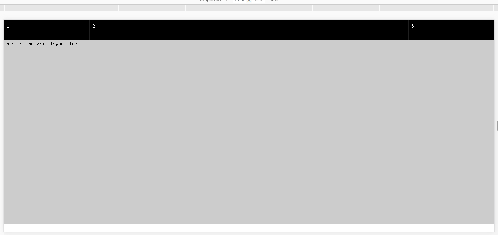

## The Grid layout

这是基于CSS flex属性实现的简易栅格系统,用法如下:

### Clone本项目,并切换至 test-layout目录下

```
$ cd test-layout 
```

### 安装node.js依赖包

```
$ npm install
```

### webpack编译/压缩

```
$ webpack -p
```

### 在html中的head标签内引入

```
<link rel="stylesheet" href="dist/style.css"/>
```

### 例子

 * 样式
 ```
 <style>
		* {
			margin: 0;
			padding: 0;
		}
		
		.box {
			flex: 1;
			height: 600px;
			background: #ccc;
		}
		.col{
			height: 45px;
			background:#000;
			color:#fff;
		}
		
	</style>
 ```
 
 * 布局

 ```
 <body>
	 <div class="box">
	   <div class="row">
	     <span class="col col2">1</span>
	     <span class="col col8">2</span>
	     <span class="col col2">3</span>
     </div>
     <div class="container">This is the grid layout test</div>
   </div>
  </body>  
 ```
 * 如图所示

  