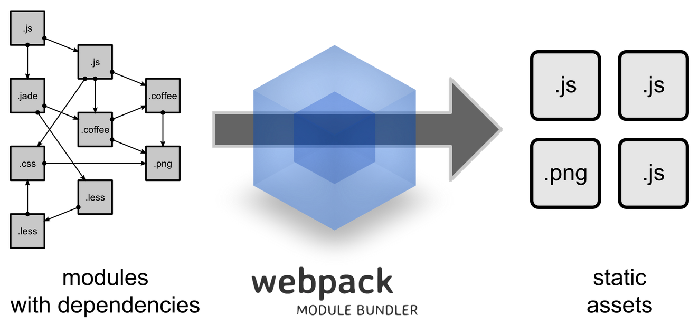

# node-study
## test pagination 

React component

## Install

#### Install node module package
```
$ cd test-pagination
$ npm install
```

## Compile and build
```
$ npm run build
```

#### You also can use this command
```
$ webpack
```

#### Build with press
```
$ webpack -p
```

## Develop
```
$ npm run dev
```

## Usage
```
//pagination.test.js

import React from 'react';
import ReactDom from 'react-dom';
import Pagination from './components/Pagination';

ReactDom.render(
  <Pagination 
  pageSize={10} 
  total={100}
  />, 
document.getElementById('example'));
```

#### Add react.js/react-dom.js in your html files
```
<!DOCTYPE>
<html lang="en">
  <head>
    <meta charset="UTF-8">
    <title>Test pagination</title>
    <meta name="description" content="test pagination" />
    <script src="https://npmcdn.com/react@15.3.1/dist/react.js"></script>
    <script src="https://npmcdn.com/react-dom@15.3.1/dist/react-dom.js"></script>
  </head>
  <body>
  </body>
</html>
```

#### Add the component
```
<!DOCTYPE>
<html lang="en">
  <head>
    <meta charset="UTF-8">
    <title>Test pagination</title>
    <meta name="description" content="test pagination" />
    <script src="https://npmcdn.com/react@15.3.1/dist/react.js"></script>
    <script src="https://npmcdn.com/react-dom@15.3.1/dist/react-dom.js"></script>
  </head>
  <body>
    <div id="example"></div>
    <script src="http://localhost:3001/js/pagination.test.js"></script>
  </body>
</html>
```

## API

| Parameter        | Description                        | Type          | Default                  |
|------------------|------------------------------------|---------------|--------------------------|
| defaultCurrent   | default current page               | Number        | 1                        |
| current          | current page                       | Number        | undefined                |
| total            | items total count                  | Number        | 0                        |
| defaultPageSize  | default items per page             | Number        | 5                      |
| pageSize         | items per page                     | Number        | 10                       |
| onChange         | page change callback               | Function([changedTo])      | -                     |
| pageSelect       | show page size select            | Bool          | false                    |
| selectOptionsPageSize  | specify the sizeChanger selections | Array<Number> | [10, 20, 30, 40, 50] |
| className        | className of pagination            | String        | -                         |
| simplePager      | when set, show simple pager        | Bool          | false                     |


## 基于React实现的分页组件

本项目是使用ECMAscript 2015的语法,并基于React 框架实现的分页组件.

### 最终效果如下


### 项目完整目录结构如下
```
├─dist
│  └─js
│          pagination.js
│          pagination.test.js
├─doc
│  └─img
│          pagination.gif       
├─example
│      index.html
├─node_modules
├─src
│   │  index.js
│   │  index.test.js
│   ├─components
│   │      Buttons.js
│   │      Pagination.js
│   │      Select.js
│   ├─lib
│   │      mc-pagination-cal.js
│  .babelrc
│  .eslintignore
│  .eslintrc
│  package.json
│  README.md
│  webpack.config.js
```

#### 目录结构说明

* dist: 存放编译好的js文件,由webpack配置生成
* doc/img: 存放文档资源文件
* example: 存放demo/实例文件
* node_modules: node依赖包,包含react/lodash/webpack等
* src: 项目开发目录
* src/components: 存放组件
* src/lib: 其他工具库
* src/index.js: 分页组件导出
* src/index.test.js: 分页组件demo实例
* .babelrc: babel编译工具配置文件
* .eslintignore: eslint工具过滤器配置文件
* .eslintrc: eslint工具配置文件
* webpack.config.js: webpack配置文件
* README.md: 项目说明文档
* package.json: 项目配置文件

### 具体实现如下

本项目主要基于`node.js`,由于使用`ECMAscript 2015`语法,所以需要`babel/webpack`等工具编译/压缩;用`Eslint`等工具进行语法检查和校验,所以再进行下一步操作之前,请确保系统含有`node.js`环境

在本项目中需要
```
node.js v6.0+
npm v3.0+
```

`node.js`下载地址:
```
https://nodejs.org/en/
```

建议进行全局安装webpack工具
```
$ npm install webpack -g
```

#### 初始化和配置项目

新建项目目录
```
$ mkdir test-pagination
```

切换至项目目录下并初始化项目
```
$ cd test-pagination
$ npm init
```

填写项目配置`package.json`,请注意不可忽略的选项
```
name: (test-pagination) //项目名称,可忽略
version: (1.0.0) //项目版本,可忽略
description: A pagination component base on React // 项目描述,可忽略
entry point: (index.js) // 默认入口文件,可忽略
test command: // 测试用命令,可忽略
git repository: //git仓库,可忽略
keywords: // 可忽略
author: Jun // 作者
license: (ISC) // 开源协议,可忽略
```

至此完成`package.json`初始化配置,配置清单如下
```
{
  "name": "test-pagination",
  "version": "1.0.0",
  "description": "",
  "main": "index.js",
  "scripts": {
    "test": "echo \"Error: no test specified\" && exit 1"
  },
  "keywords": [
    "pagination",
    "react"
  ],
  "author": "Jun",
  "license": "ISC"
}
```

接下来在`package.json`配置开发环境

加入`React`依赖包
```
"dependencies": {
  "lodash": "4.16.4",
  "react": "15.2.1",
  "react-dom": "15.2.1"
}
```

加入`webpack`工具
```
"devDependencies": {
  "extract-text-webpack-plugin": "~0.8.2",
  "webpack": "^1.7.3",
  "webpack-dev-server": "^1.16.2"
}
```

由于需要使用`ES6`语法编写,加入`babel`编译工具
```
"devDependencies": {
  "babel-core": "^6.5.2",
  "babel-eslint": "^4.1.8",
  "babel-loader": "^6.2.2",
  "babel-plugin-add-module-exports": "^0.1.2",
  "babel-plugin-transform-runtime": "^6.15.0",
  "babel-preset-es2015": "^6.18.0",
  "babel-preset-es2015-ie": "6.x",
  "babel-preset-react": "^6.3.13",
  "babel-preset-stage-1": "^6.16.0",
  "babel-register": "^6.18.0",
  "extract-text-webpack-plugin": "~0.8.2",
  "webpack": "^1.7.3",
  "webpack-dev-server": "^1.16.2"
}
```

加入代码校验工具`eslint`
```
"devDependencies": {
  "babel-core": "^6.5.2",
  "babel-eslint": "^4.1.8",
  "babel-loader": "^6.2.2",
  "babel-plugin-add-module-exports": "^0.1.2",
  "babel-plugin-transform-runtime": "^6.15.0",
  "babel-preset-es2015": "^6.18.0",
  "babel-preset-es2015-ie": "6.x",
  "babel-preset-react": "^6.3.13",
  "babel-preset-stage-1": "^6.16.0",
  "babel-register": "^6.18.0",
  "eslint": "^1.10.3",
  "eslint-config-airbnb": "^5.0.1",
  "eslint-loader": "^1.6.3",
  "eslint-plugin-react": "^3.16.1",
  "extract-text-webpack-plugin": "~0.8.2",
  "webpack": "^1.7.3",
  "webpack-dev-server": "^1.16.2"
}
```

配置`webpack` `build`命令和`webpack-dev-server`开发环境,可用于实时调试和热部署项目
```
"scripts": {
  "test": "echo \"Error: no test specified\" && exit 1",
  "dev": "webpack-dev-server --devtool eval --progress --colors --open --hot --content-base ./example",
  "build": "webpack -p --colors"
}
```

* 在本项目中会用到的`webpack/webpack-dev-server`命令说明

  `webpack`

  | Command        | Description                        |
  |------------------|------------------------------------|
  | webpack          | 主命令：执行编译/混合/CSS样式,开发模式,代码未压缩处理,并包含webpack相关编译代码  |
  | -p         | 主命令：执行编译/压缩/混合/CSS样式,不包含webpack相关编译代码  |
  | -w         | 执行编译/混合/CSS样式,开发模式,实时监听代码变化,并进行编译/压缩/混合等一系列热部署操作  |
  | -p --color        | 主命令：执行编译/压缩/混合/CSS样式,不包含webpack相关编译代码,并高亮显示控制台输出结果  |
  | -h         | 查看更多webpack命令  |


  `webpack-dev-server`

  | Command        | Description                        |
  |------------------|------------------------------------|
  | webpack-dev-server          | 主命令：启动`webpack`开发调试服务  |
  | --devtool eval          | 启用开发者模式,编译后代码包含`sourcemap`等信息,可用于浏览器进行调试  |
  | --progress          | 显示`webpack` `building`进度  |
  | --colors          | 高亮显示控制台输出结果  |
  | --open          | 浏览器自动刷新  |
  | --hot          | `webpack`服务实时监听  |
  | --content-base ./example | `webpack`服务启动入口`html`文件目录设置,例如`example`目录  |

至此`package.json`配置完成,在之后的开发中如果需要其他配置和依赖包,可按照如上步骤,以下是完整`package.json`清单
```
{
  "name": "test-pagination",
  "version": "0.0.1",
  "description": "react pagination",
  "main": "index.js",
  "scripts": {
    "test": "echo \"Error: no test specified\" && exit 1",
    "dev": "webpack-dev-server --devtool eval --progress --colors --open --hot --content-base ./example",
    "build": "webpack -p --colors"
  },
  "keywords": [
    "react",
    "pagination"
  ],
  "author": "Jun",
  "license": "ISC",
  "devDependencies": {
    "babel-core": "^6.5.2",
    "babel-eslint": "^4.1.8",
    "babel-loader": "^6.2.2",
    "babel-plugin-add-module-exports": "^0.1.2",
    "babel-plugin-transform-runtime": "^6.15.0",
    "babel-preset-es2015": "^6.18.0",
    "babel-preset-es2015-ie": "6.x",
    "babel-preset-react": "^6.3.13",
    "babel-preset-stage-1": "^6.16.0",
    "babel-register": "^6.18.0",
    "eslint": "^1.10.3",
    "eslint-config-airbnb": "^5.0.1",
    "eslint-loader": "^1.6.3",
    "eslint-plugin-react": "^3.16.1",
    "extract-text-webpack-plugin": "~0.8.2",
    "webpack": "^1.7.3",
    "webpack-dev-server": "^1.16.2"
  },
  "dependencies": {
    "lodash": "4.16.4",
    "react": "15.2.1",
    "react-dom": "15.2.1"
  }
}
```

安装上面配置好的依赖包(这一步执行完毕,才能继续下面的操作否则`eslint`等工具会提示报错)
```
$ npm install
```

配置编译工具babel

如果`.babelrc`文件不存在,则新建,配置清单如下
```
{
    "presets": [
        "es2015",
        "react"
    ],
    "plugins": [
        "transform-runtime"
    ]
}
```

由于并不需要让`babel`编译依赖包目录`node_modules`,所以需要进行配置,新建`.eslintignore`文件,配置如下
```
node_modules
```

接下来配置`js`语法校验工具,按照`ECMAscript 2015`标准对语法进行检验,在这里我们使用`Airbnb`的`eclint`的规则,在前面的`package.json`中已加入依赖包;新建`.eslintrc`,配置清单如下
```
{
    "env": {
    "node": true,
    "es6": true,
    "browser": true
  },
  "parser": "babel-eslint",
  "extends": "airbnb",
  "rules": {
    "no-var": [
      0
    ],
    "no-console": 1,
    "no-unused-vars":1,
    "no-param-reassign":1,
    "react/jsx-no-bind":1
  }
}
```

#### webpack配置（项目构建）



如果完成前面的项目初始化配置,接下来可以配置webpack清单,配置明细如下

引入`node` `path`模块,用于获取文件路径 
引入`ExtractTextPlugin`外部加载文件插件
初始化`node`依赖包路径
```
const path = require('path');
const ExtractTextPlugin = require('extract-text-webpack-plugin');
const nodeModulesPath = path.resolve(__dirname, 'node_modules');
```

* 这里使用`ECMAscript 2015`不可随意修改的变量类型`const`,具有块级作用域的作用,可避免`var`声明的变量存在变量提升和随意修改的问题 

在这里使用`module.export`导出配置
```
module.exports = {
  //webpack配置清单
}
```

设置`devtool`属性为`false`,在`webpack`打包时不生成`sourcemap`信息,
```
module.exports = {
  devtool: false
}
```

设置`webpack`入口文件,即编译入口文件
```
entry: {
  'pagination.test': path.join(__dirname, 'src', 'index.test.js'),// demo测试程序入口文件
  pagination: path.join(__dirname, 'src', 'index.js'), // 分页组件入口文件
}
```

设置输出文件目录以及`chunk`文件
```
output: {
  path: path.join(__dirname, 'dist'), // 输出目录（编译生成文件目录）
  publicPath: '',
  filename: 'js/[name].js', // 编译生成的文件,文件名由前面入口文件配置确定
  chunkFilename: 'js/[id].chunk.js',
}
```

模块和插件配置

配置`Eslint`预加载,用于语法检查
```
module: {
  preLoaders: [
    {
      // Eslint loader
      test: /\.(js|jsx)$/,
      loader: 'eslint-loader',
      include: [path.resolve(__dirname, 'src')],
      exclude: [nodeModulesPath],
    },
  ]
}
```

配置加载模块插件,在本项目中仅编译`js`所以仅加载`js`的编译工具,同时排除`node`依赖包的编译,且使用`babel`;在之后会补充`css/sass`模块插件
```
module: {
  preLoaders: [
    {
      // Eslint loader
      test: /\.(js|jsx)$/,
      loader: 'eslint-loader',
      include: [path.resolve(__dirname, 'src')],
      exclude: [nodeModulesPath],
    },
  ],
  loaders: [
    { 
      test: /\.js?$/,
      exclude: /node_modules/,
      loader: 'babel',
    },
  ]
}
```

为了便于更好的扩展性,且同时编译`react/react-dom`,生成的文件会很大,比较消耗资源,在页面中加载数MB的`js`文件并不理想,所以在这里进行如下配置,可以将`react/react-dom`通过`CDN`依赖等外部引入的方式加载至页面
```
externals: {    // 指定采用外部 CDN 依赖的资源,不被webpack打包
  react: 'React',
  'react-dom': 'ReactDOM',
}
```

`webpack-dev-server`也可以在这里配置,包括服务监听端口号
```
devServer: {
  hot: true,
  inline: true, // webpack-dev-server有两种模式,默认是false,即在页面中加入frame标签构建调试页面;若为true则是在完整页面中构建调试页面
  progress: true,
  port: '3001',
}
```

加载`eslint`配置文件,由于上面进行`eslint`模块预加载,在这里需要加入`eslint`配置文件
```
eslint: {
  configFile: '.eslintrc',
}
```

完整`webpack`清单如下
```
const path = require('path');
const ExtractTextPlugin = require('extract-text-webpack-plugin');
const nodeModulesPath = path.resolve(__dirname, 'node_modules');

module.exports = {
  devtool: false,
  entry: {
    'pagination.test': path.join(__dirname, 'src', 'index.test.js'),
    pagination: path.join(__dirname, 'src', 'index.js'),
  },

  output: {
    path: path.join(__dirname, 'dist'),
    publicPath: '',
    filename: 'js/[name].js',
    chunkFilename: 'js/[id].chunk.js',
  },
  module: {
    preLoaders: [
      {
        // Eslint loader
        test: /\.(js|jsx)$/,
        loader: 'eslint-loader',
        include: [path.resolve(__dirname, 'src')],
        exclude: [nodeModulesPath],
      },
    ],
    loaders: [
      {
        test: /\.js?$/,
        exclude: /node_modules/,
        loader: 'babel',
      },
    ],
  },
  externals: {    // 指定采用外部 CDN 依赖的资源,不被webpack打包
    react: 'React',
    'react-dom': 'ReactDOM',
  },
  devServer: {
    hot: true,
    inline: true,
    progress: true,
    port: '3001',
  },
  eslint: {
    configFile: '.eslintrc',
  },
};
```

配置好`webpack`清单,基本上可以执行`webpack`相关命令了

#### 组件具体实现

本项目实现的分页组件由多个子组件组成,目前仅实现了基础子组件,之后会不断完善

| Component        | Description                        |
|------------------|------------------------------------|
| Buttons          | 分页按钮,包括每页按钮,下一页按钮,多页跳转按钮  |
| Pagination       | 分页组件主结构                       |
| Select           | 分页组件选择每页显示的数目            |

#### 在`src/components`目录中新建如下文件
```
Buttons.js // 分页按钮组件
Pagination.js // 分页组件主结构
Select.js // 下拉选择数目组件
```

#### 实现`Buttons`组件

引入react.js
```
import React from 'react';
```

* `ECMAscript 2015`标准,规定了在`js`文件中可以使用`import`/`from`关键字引入其他目录的`js`模块文件

定义`Buttons`类,并继承`React` `Component`父类
```
class Buttons extends React.Component {

}
```

* `ECMAscript 2015`标准,规定了`class`的用法与标准


定义`Buttons`类的构造方法,构造函数，在创建组件的时候调用一次,用来在之后的方法中引用父类(`React.Component`)的`this`对象
```
class Buttons extends React.Component {
  constructor(props) {
    super(props);
  }
}
```

在上面的实现效果图中,分页按钮包括含有分页编号的按钮/上一页/下一页/向前几页跳转/向后几页跳转等.因此需要定义`Buttons` `props`如下默认属性

| PropTypes        | Description                        |Type              | Default        |
|------------------|------------------------------------|-------------------|----------------|
| pageNumber       | 分页编号                            | number            |                |
| active           | 是否是当前选中的分页                 | number            | false          |
| className        | 按钮class属性                       | number            |                |

代码如下：
```
Buttons.propTypes = {
  pageNumber: React.PropTypes.number,
  active: React.PropTypes.bool,
  className: React.PropTypes.string,
};

Buttons.defaultProps = {
  active: false,
};
```

实现`render`方法,react.js渲染组件时执行的实现方法
```
render() {

}
```

初始化`props`对象,`props`中包含上面定义的属性,包括react封装好的属性
```
render() {
    const props = this.props;
}
```

按钮组件需要继承父组件的属性包括`className`集合,即多个`class`值,所以这里初始化父组件父组件`class`值
```
render() {
    const props = this.props;
    const prefix = `${props.rootClassNamePrefix}-btn`; // 继承父组件class属性前缀
    let tempClassName = `${prefix}`;
}
```

组装`className`属性
```
render() {
    const props = this.props;
    const prefix = `${props.rootClassNamePrefix}-btn`;
    let tempClassName = `${prefix}`;
    if (props.pageNumber) {
      tempClassName += ` ${prefix}-${props.pageNumber}`;
    }
    if (props.active) {
      tempClassName += ` ${prefix}-active`; // 设置active标识
    }
    if (props.className) {
      tempClassName += ` ${props.className}`;
    }
}
```

返回组件标签值
```
render() {
    const props = this.props;
    const prefix = `${props.rootClassNamePrefix}-btn`;
    let tempClassName = `${prefix}`;
    if (props.pageNumber) {
      tempClassName += ` ${prefix}-${props.pageNumber}`;
    }
    if (props.active) {
      tempClassName += ` ${prefix}-active`;
    }
    if (props.className) {
      tempClassName += ` ${props.className}`;
    }

    return (
      <li title={props.title} // 设置html title属性
          className={tempClassName} // 
          onClick={props.onClick}> // 对按钮设置点击事件属性
        <a>{props.btnContent}</a>
      </li>
    );
  }
```

至此按钮组件完成,接下来需要导出`Buttons`类供其他组件复用
```
export default Buttons;
```

这里使用ECMAscript 2015规范中的`export`,即暴露供外部调用的`class/function/变量`等,其他类如果需要使用,只需按如下方式,使用`import/from`等关键字 
```
import Buttons from './Buttons';
```

在`Pagination.js`中引入`react.js`
```
import React from 'react';
```

再按照上文所说引入`Buttons`组件

定义父组件`Pagination`类,并继承React.Component
```
class Pagination extends React.Component {

}
```

定义构造方法并继承`React.Component`的`this`对象
```
class Pagination extends React.Component {
  constructor(props) {
    super(props);
  }
}
```

定义`Pagination` `props`属性(对外暴露)

| PropTypes        | Description                        |Type              | Default        |
|------------------|------------------------------------|-------------------|----------------|
| current          | 当前页编号                          | number            |                 |
| defaultCurrent   | 默认当前页                          | number            | 1               |
| defaultPageSize  | 默认分页每页显示数目                 | number            | 5               |
| total            | 数据总数                            | number            | 0               |
| pageSize         | 分页每页显示数目                     | number            |                 |
| classNamePrefix  | className属性前缀                   | string            | mc-pagination   |
| onChange         | 页面是否变化                        | func               |                | 
| displayLength    | 显示按钮数量                         | number            | 5               |
| simplePager      | 是否手动跳转指定页面                  | bool              | false           | 
| pageSelect       | 是否选择分页每页显示的数目            | bool               | false           | 
| selectOptionsPageSize | 分页显示数目选项                | array              | (默认值取子组件) |

代码如下
```
Pagination.propTypes = {
  current: React.PropTypes.number,
  defaultCurrent: React.PropTypes.number,
  defaultPageSize: React.PropTypes.number,
  total: React.PropTypes.number,
  pageSize: React.PropTypes.number,
  classNamePrefix: React.PropTypes.string,
  onChange: React.PropTypes.func,
  displayLength: React.PropTypes.number,
  simplePager: React.PropTypes.bool,
  pageSelect: React.PropTypes.bool,
  selectOptionsPageSize: React.PropTypes.arrayOf(React.PropTypes.number),
};

Pagination.defaultProps = {
  defaultCurrent: 1,
  defaultPageSize: 5,
  total: 0,
  classNamePrefix: 'mc-pagination',
  onChange: temp,
  displayLength: 5,
  simplePager: false,
  pageSelect: false,
};
```

本项目实现的分页算法如下

在实际效果图中,分页组件由四个部分组成,如图所示


 
> 上一页/下一页按钮(蓝色框) 

> 第一页/最后一页按钮(绿色框)

> 向前跳转更多页/向后跳转更多页(紫色框)

> 页码按钮(红色框)

* 首先定义数组容器,用于存放分页按钮 
```
const pageList = [];
```

* 第一页始终保持静态,但是当点击触发时该按钮状态变为`active`,即先默认初始化第一页的按钮
```
pageList.push(<Buttons
      rootClassNamePrefix={props.classNamePrefix}
      title={1}
      key={1}
      onClick={this._handleChange.bind(this, 1)}
      btnContent={1}
      pageNumber={1}
    />);
```
这里是`react` `jsx`语法的写法,配置`Buttons`组件即可,详细请看下面

* 最后一页即为总页数,总页数由总数目决定,算法如下
```
this.props.total / pageSize
```

在这里是需要取整页数,且页码计算是从0开始,所以调整如下
```
Math.floor((this.props.total - 1) / pageSize) + 1;
```

* `props.displayLength`属性控制显示页码按钮数目,默认设置是5,即显示5个页码按钮
* 接下来需要确定如何动态控制页码按钮,如效果图所示.设定两个锚点值,左锚与右锚.其中右锚由左锚加上`props.displayLength`再减去1得到,如下
假设当前分页组件的页码状态如下
```
1 ... 6(锚) 7 8 9 10(锚) ... 200
```

点击第10页,如下
```
1 ... 10(锚) 11 12 13 14(锚) ... 200
```

点击第11页至第13页锚不发生改变
```
1 ... 10(锚) 11 12 13 14(锚) ... 200
```

点击向前或向后跳转回到第1页或最后一页,如下
```
1 2(锚) 3 4 5 6(锚) ... 200
```
```
1 ... 195(锚) 196 197 198 199(锚) 200
```

* 由上可知,初始化如下参数
```
const anchor = this.state.leftAnchor; // 起始锚点,不可修改
const length = this._calcTotalPage(); // 总长度(总页数),不可修改
const dl = this.props.displayLength; // 步长(页码按钮数量),不可修改
let start = 2; // 起始变化值(左锚点)
let end = start + dl - 1; // 结束变化值(右锚点)
```

* 执行状态判断
```
// n 当前页码,如果当前页码小于等于0,则赋初始值1,即回到第一页
if (n <= 0) {  
  n = 1;
}

// 如果当前页码大于等于最后一页,则赋length给n,即回到最后一页
if (n >= length) { 
  n = length;
}

// 如果当前页码大于起始锚点(上一个状态的左锚点),则赋anchor给start,否则赋n给start,即确定左锚点
if (n >= anchor) {
  start = anchor;
} else {
  start = n;
}

// 右锚点就是左锚点加步长
end = start + dl - 1;

// 此时存在右锚点小于当前页码值的情况,因此重新确定左右锚点
if (end <= n) {
  start = n;
  end = start + dl - 1;
}

// 此时起始锚点值(左锚点)被改变,存在小于1的情况,
// 因此重新确定锚点,即回到第1页
if (start <= 1) {
  start = 2;
  end = start + dl - 1;
}

// 如果起始锚点不存在小于1的情况,那么锚点结束位置存在大于总长度的情况,
// 因此赋length - 1 给end,同时重新确定锚点
if (end >= length - 1) {
  end = length - 1;
  start = end - dl + 1;
  if (start <= 1) {
    start = 2;
  }
}
```

至此页面计算完毕,接下来初始化`Pagination`组件`props`属性和状态处理

根据react核心基本原理,当状态(state)发生改变时,立刻刷新组件,重新渲染dom元素.因此上面的算法实现的分页按钮点击事件操作都会用当前页码值改变组件状态,刷新组件.因此在这里做初始化state.current属性
```
class Pagination extends React.Component {
  constructor(props) {
    super(props);

    let current = props.defaultCurrent;

    this.state = {
      current,
    }
  }
}
```

同时需要监听锚点状态,因此也需要初始化
```
class Pagination extends React.Component {
  constructor(props) {
    super(props);

    const start = 2;
    const end = start + props.displayLength - 1;

    let current = props.defaultCurrent;

    this.state = {
      current,
      leftAnchor: start,
      rightAnchor: end,
    };
  }
}
```

接下来实现钩子函数用来改变事件状态
```
 _handleChange(n) {
    const tempAnchor = this._calcPage(n); // 前面实现的_calcPage动态页码按钮计算函数
 
    this.setState({
      current: tempAnchor.n,
      _current: tempAnchor.n,
      leftAnchor: tempAnchor.start,
      rightAnchor: tempAnchor.end,
    });

    return this.state.current;    
 }
```

至此钩子函数实现,由以上算法和原理以及钩子函数,可以依次实现下一页/上一页/向前向后跳转按钮事件,例如
```
// 是否有上一页
_hasPrev() {
  return this.state.current > 1;  // this.state.current当前页(当前状态)
}

//是否有下一页
_hasNext() {
  return this.state.current < this._calcTotalPage(); // 由以上逻辑实现的,_calcTotalPage计算总页数函数
}

//上一页
_prev() {
  if (this._hasPrev()) {
    this._handleChange(this.state.current - 1);
  }
}

//下一页
_next() {
  if (this._hasNext()) {
    this._handleChange(this.state.current + 1);
  }
}


//向前/向后跳转displayLength长度的页面
_leftMore() {
  return this._handleChange((this.state.current - this.props.displayLength) <= 0 ? 
    1 : (this.state.current - this.props.displayLength));
}

_rightMore() {
  const totalPage = this._calcTotalPage();
  return this._handleChange((this.state.current + this.props.displayLength) >= totalPage ?
    totalPage : (this.state.current + this.props.displayLength));
}
```

至此分页逻辑基本实现，但是需要做调整

* 方法绑定父类`this`对象
```
class Pagination extends React.Component {
  constructor(props) {
    super(props);

    const start = 2;
    const end = start + props.displayLength - 1;

    let current = props.defaultCurrent;

    this.state = {
      current,
      leftAnchor: start,
      rightAnchor: end,
    };

    [
      'render',
      '_handleChange',
      '_isValid',
      '_leftMore',
      '_rightMore',
      '_hasPrev',
      '_hasNext',
      '_prev',
      '_next',
    ].forEach((method) => this[method] = this[method].bind(this));
  }
}
```

* 实现开放API接口

到这里，`Pagination`组件暂时仅仅只能被react-dom渲染至页面，不能当作子组件复用，例如

在`index.test.js`中编写如下代码,以渲染组件
```
import React from 'react';
import ReactDom from 'react-dom';
import Pagination from './components/Pagination';

ReactDom.render(<Pagination
  pageSize={10} total={999} displayLength={5}
/>, document.getElementById('example'));
```

在`example/index.html`中引用
```
<!DOCTYPE html>
<html lang="en">

<head>
  <meta charset="UTF-8">
  <title>Test pagination</title>
  <meta name="description" content="test pagination" />
  <script src="https://npmcdn.com/react@15.3.1/dist/react.js"></script>
  <script src="https://npmcdn.com/react-dom@15.3.1/dist/react-dom.js"></script>
</head>

<body>
  <div id="example"></div>
  <script src="http://localhost:3001/js/pagination.test.js"></script>

</body>
</html>
```  
> 本实例按照之前配置的webpack-dev-server启动，在浏览器中输入如下地址，即可查看demo和调试

```
http://localhost:3001/
```

如上所示，即使配置`current`也不起任何作用，无法满足复用，因此需要使用`react`组件生命周期`API`

`props`是父组件传递给子组件的.父组件发生`render`的时候子组件就会调用`componentWillReceiveProps`(不管`props`有没有更新，也不管父子组件之间有没有数据交换)
```
componentWillReceiveProps(nextProps) {

}
``` 

在`componentWillReceiveProps`方法内处理当前页状态和锚点状态变化
```
componentWillReceiveProps(nextProps) {

  // 如果设置current属性，则先做页面分配计算
  const n = nextProps.current; 
  const tempAnchor = this._calcPage(n);

  if ('current' in nextProps) {  // 改变页面状态
    this.setState({
      current: tempAnchor.n,
      _current: tempAnchor.n,
      leftAnchor: tempAnchor.start,
      rightAnchor: tempAnchor.end,
    });
  }
}
```

同时需要在构造函数中做初始化处理
```
class Pagination extends React.Component {
  constructor(props) {
    super(props);
    
    // ...

    let current = props.defaultCurrent;

    if ('current' in props) {
      current = props.current;
    }

    // ...
  }
}
```

需要补充页面校验函数
```
_isValid(num) {
  return typeof num === 'number' && num >= 1 && num !== this.state.current;
}
```

改进钩子函数`_handleChange`
```
_handleChange(n) {
  const tempAnchor = this._calcPage(n);
  if (this._isValid(n)) {
    if (!('current' in this.props)) {
      this.setState({
        current: tempAnchor.n,
        _current: tempAnchor.n,
        leftAnchor: tempAnchor.start,
        rightAnchor: tempAnchor.end,
      });
    }

    const pageSize = this.state.pageSize;
    this.props.onChange(n, pageSize);

    return n;
  }

  return this.state.current;
}
```

实现`pageSize`选择组件

同上`pageSize`改变引发状态改变，即重新渲染组件，所以做如下设置
```
//构造函数初始化pageSize
class Pagination extends React.Component {
  constructor(props) {
    super(props);

    // ...
    let pageSize = props.defaultPageSize;
    if ('pageSize' in props) {
      pageSize = props.pageSize;
    }

    this.state = {
      // ...
      pageSize,
      // ...
    };

    // ...
  }
}
```

同上在生命周期函数中需要对`pageSize`状态发生变化做处理，重新计算页面分配,改变当前页面状态
```
componentWillReceiveProps(nextProps) {
  
  // ...

  if ('pageSize' in nextProps) {
    const newState = {};
    let current = this.state.current;
    const newCurrent = this._calcTotalPage(nextProps.pageSize);
    current = current > newCurrent ? newCurrent : current;
    const tempAnchor2 = this._calcPage(current);
    if (!('current' in nextProps)) {
      newState.current = tempAnchor2.n;
      newState._current = tempAnchor2.n;
      newState.leftAnchor = tempAnchor2.start;
      newState.rightAnchor = tempAnchor2.end;
    }
    newState.pageSize = nextProps.pageSize;
    this.setState(newState);
  }
}
```

通过上面一系列调整，接下来可以实现`Select`组件的`_changePageSize`方法
```
_changePageSize(size) {
  let current = this.state.current;
  const newCurrent = this._calcTotalPage(size);
  current = current > newCurrent ? newCurrent : current;
  const tempAnchor = this._calcPage(current);
  if (typeof size === 'number') {
    if (!('pageSize' in this.props)) {
      this.setState({
        pageSize: size,
      });
    }

    if (!('current' in this.props)) {
      this.setState({
        current: tempAnchor.n,
        _current: tempAnchor.n,
        leftAnchor: tempAnchor.start,
        rightAnchor: tempAnchor.end,
      });
    }
  }

  return size;
}
```

为`_changePageSize`方法绑定`this`对象
```
class Pagination extends React.Component {
  constructor(props) {
    super(props);
    [
    // ... 
    '_changePageSize',
    ].forEach((method) => this[method] = this[method].bind(this));
  }
}
```

在Select.js中引入react
```
import React from 'react';
```

定义`Select`类，继承`React.Component`,并定义构造函数继承父类`this`对象
```
class Select extends React.Component {
  constructor(props) {
    super(props);
  }
}
```

定义对外暴露属性，并设置默认值

| PropTypes        | Description                        |Type              | Default        |
|------------------|------------------------------------|-------------------|----------------|
| pageSize         | 初始每页显示数目                    | number            |                |
| changeSize         | select钩子函数用于pageSize状态改变                   | func            |                |
| selectOptionsPageSize | 每页显示数目选项                    | array(number)            | [10, 20, 30, 40, 50]               |


代码如下
```
Select.propTypes = {
  pageSize: React.PropTypes.number,
  changeSize: React.PropTypes.func,
  selectOptionsPageSize: React.PropTypes.arrayOf(React.PropTypes.number),
};

Select.defaultProps = {
  selectOptionsPageSize: [10, 20, 30, 40, 50],
};
```

实现下拉框选择钩子函数监听选择事件改变`Pagination` `pageSize`状态
```
_changeSize(event) {
  const value = event.target.value;
  this.props.changeSize(Number(value));
}
```
> 1

实现render方法，返回并导出Select组件
```
render() {
  const props = this.props; 
  const pageSize = props.pageSize || props.selectOptionsPageSize[0]; //设置select初始默认值
  const options = props.selectOptionsPageSize.map((o, i) => (
    <option key={i} value={o}>{o}</option>
  )); //根据selectOptionsPageSize组装options
  return (
    <select
      onChange={this._changeSize}
    >
      {options}
    </select>
  );
}

// ...

export default Select;
```

为实现方法绑定`this`对象
```
[
  'render',
  '_changeSize',
].forEach((method) => this[method] = this[method].bind(this));
```
> 2

在`Pagination`组件中引入`Select`组件
```
import Select from './Select';
```


实现`pageSelect`,即当`pageSelect`为`true`时显示分页展示数量选择框，如图所示


代码如下
```
render() {

  // ...

  let pageSelect; // Select 组件

  // ...

  if (props.pageSelect) {
    pageSelect = (<li
      className={`${props.classNamePrefix}-options`} //设置class

      // 在react中如果渲染多个组件需要赋key值
      key={`pageSelect`}  
      selectOptionsPageSize={props.selectOptionsPageSize}
      >
      <Select changeSize={this._changePageSize.bind(this)} />
      </li>);
  }

  // ...
}
```

通过钩子函数实现手动输入指定页面并按回车键跳转至指定页面
```
_handleKeyEnter(event) {
  const value = event.target.value;
  let tempValue;
  if (isNaN(Number(value))) {
    tempValue = this.state.current;
  } else {
    tempValue = Number(value);
  }
  if (event.keyCode === 13) {
    this._handleChange(tempValue);
  }
}
```

为`_handleKeyEnter`函数绑定`this`对象
```
class Pagination extends React.Component {
  constructor(props) {
    super(props);
    [
    // ... 
    '_handleKeyEnter',
    ].forEach((method) => this[method] = this[method].bind(this));
  }
}
```

在`render`方法中添加手动输入跳转指定页面的`input`组件，且当`simplePager`属性为`true`时做渲染
```
render() {

  // ...

  let simplePager; // input手动输入框组件

  // ...

  if (props.simplePager) {
    simplePager = (<li
      className={`${props.classNamePrefix}-input-go`}
      key={`simplePager`}
    >跳至
    <input
      type="text" onKeyUp={this._handleKeyEnter}
    />页
    </li>);
  }
}
```

至此，组件基本逻辑改进完成，接下来时组装和最后的导出组件

组装分页页码按钮/下一页/上一页/向前跳转/向后跳转按钮
```
render() {
  const props = this.props;
  const pageList = [];
  const totalPage = this._calcTotalPage(); //获取总页数
  const { current, pageSize } = this.state;

  // ...

  // 第一页按钮，并设置onClick属性和钩子事件函数
  pageList.push(<Buttons
      rootClassNamePrefix={props.classNamePrefix}
      title={1}
      key={1}
      onClick={this._handleChange.bind(this, 1)}
      btnContent={1}
      pageNumber={1}
      active={current === 1}
    />);

  // 向前跳转按钮，且当左锚点大于2(第2页)时，才渲染  
  if (this.state.leftAnchor > 2) {
    pageList.push(<Buttons
      rootClassNamePrefix={props.classNamePrefix}
      className={`${props.classNamePrefix}-jump-prev`}
      title={`•••`}
      key={`leftMore`}
      onClick={this._leftMore}
      btnContent={`•••`}
    />);
  }

  //根据锚点循环组装页码按钮
  for (let i = this.state.leftAnchor; i <= this.state.rightAnchor; i++) {
    const isActive = this.state.current === i;
    pageList.push(
      <Buttons
        rootClassNamePrefix={props.classNamePrefix}
        title={i}
        key={i}
        onClick={this._handleChange.bind(this, i)}
        btnContent={i}
        pageNumber={i}
        active={isActive}
      />);
  }

  //向后跳转,且当右锚点小于(totalPage - 1)(最后一页减一)时，才渲染  
  if (this.state.rightAnchor < (totalPage - 1)) {
    pageList.push(<Buttons
      rootClassNamePrefix={props.classNamePrefix}
      className={`${props.classNamePrefix}-jump-next`}
      title={`•••`}
      key={`rightMore`}
      onClick={this._rightMore}
      btnContent={`•••`}
    />);
  }

  //最后一页按钮
  pageList.push(<Buttons
    rootClassNamePrefix={props.classNamePrefix}
    title={totalPage}
    key={totalPage}
    onClick={this._handleChange.bind(this, totalPage)}
    btnContent={totalPage}
    pageNumber={totalPage}
    active={this.state.current === totalPage}
  />);

}
```

导出组件，这里用svg生成上一页下一页按钮样式
```
render() {

  // ...

  return (
    // 设置组件class属性
    <ul className={`${props.classNamePrefix} ${props.className}`}>

      // 上一页按钮
      <Buttons
        rootClassNamePrefix={props.classNamePrefix}
        title={`上一页`}
        onClick={this._prev}

        // 在这里使用svg,包括svg的样式
        btnContent={<svg viewBox={`0 0 24 24`}
          style={{
            display: 'inline-block',
            color: (this._hasPrev() ? 'rgba(0, 0, 0, 0.870588)' : '#ccc',
            fill: 'currentcolor',
            height: '24px',
            width: '24px',
            userSelect: 'none',
            transition: 'all 450ms cubic-bezier(0.23, 1, 0.32, 1) 0ms',
          }}
        >
          <path
            d={'M15.41 7.41L14 6l-6 6 6 6 1.41-1.41L10.83 12z'}
          ></path>
        </svg>}
        className={`${props.classNamePrefix}-btn-prev ${this._hasPrev() ? '' :
            `${props.classNamePrefix}-btn-disabled`}`}
      />
      {pageList}

      // 下一页按钮
      <Buttons
        rootClassNamePrefix={props.classNamePrefix}
        title={`下一页`}
        onClick={this._next}
        btnContent={<svg
          viewBox={`0 0 24 24`}
          style={{
            display: 'inline-block',
            color: (this._hasNext() ? 'rgba(0, 0, 0, 0.870588)' : '#ccc'),
            fill: 'currentcolor',
            height: '24px',
            width: '24px',
            userSelect: 'none',
            transition: 'all 450ms cubic-bezier(0.23, 1, 0.32, 1) 0ms',
          }}
        >
          <path
            d={`M10 6L8.59 7.41 13.17 12l-4.58 4.59L10 18l6-6z`}
          >
          </path></svg>}
        className={`${props.classNamePrefix}-btn-next ${this._hasNext() ? '' :
            `${props.classNamePrefix}-next-btn ${props.classNamePrefix}-btn-disabled`}`}
      />

      // 页面选择组件
      {pageSelect}

      // 手动输入页面组件
      {simplePager}
    </ul>
  );
}

// ...

// 导出Pagination组件
export default Pagination;
```

到这里分页组件所有逻辑均已实现，接下来是用法以及开发环境的调试

#### 用法


