# node-study
## Study React

React.js\ECMAScript 2015\Webpack usage

## Install

#### Install node module package
```
$ cd test-dialog
$ npm install
```

## Compile and build
```
$ npm run build
```

#### You also can use this command
```
$ webpack
```

#### Build with press
```
$ webpack -p
```

## Develop
```
$ npm run dev
```

## `React`(`ECMAScript 2015`)以及`Webpack`工具基本用法

本项目是对`React`和`Webpack`工具的基本用法的简单应用,并且整个项目均使用`ECMAScript 2015`规定的`Javascript`语法,欢迎指正错误,欢迎补充,欢迎`fork` :)

<a name="0"></a>
### 目录·
  1. [准备](#1)
  1. [关于`ECMAScript 2015`(`Javascript`)](#2)

      2.1  [关于`Babel`](#2.1)

          2.1.1  [`Babel`使用](#2.1.1)
      
      2.2  [关于`Eslint`](#2.2)

          2.2.1  [`eslint`使用](#2.2.1)

          2.2.2  [`eslint`使用](#2.2.2)

  1. [关于React](#3)
  1. [关于`Webpack`](#4)

      4.1  [`Webpack`特点](#4.1)

  1. [初始化项目准备](#5)

      5.1  [创建项目目录,并初始化](#5.1)

      5.2  [初始化`package.json`](#5.2)

          5.2.1  [`package.json`初始化配置清单](#5.2.1)

          5.2.2  [配置项目完整清单](#5.2.2)

          5.2.3  [配置`Webpack`开发环境(`webpack-dev-server`)](#5.2.3)

      5.3  [完整`package.json`清单](#5.3)

      5.4  [新建工程目录`src`](#5.4)

          5.4.1  [在`src`目录下新建组件目录`components`,静态资源图片目录`img`,静态html页面资源目录`view`](#5.4.1)

          5.4.2  [在`src`新建出口文件`index.js`和用于测试的出口文件](#5.4.2)

  1. [`webpack`配置（项目构建）](#6)

      6.1  [初始化](#6.1)

      6.2  [模块和插件配置](#6.2)

          6.2.1  [配置`ESLint`预加载,用于语法检查](#6.2.1)

          6.2.2  [配置加载模块插件,在本项目中仅编译`js`所以仅加载`js`的编译工具,同时排除`node.js`依赖包的编译](#6.2.2)

          6.2.3  [外部引入`react/react-dom`](#6.2.3)

          6.2.4  [`webpack-dev-server`也可以在这里配置,包括服务监听端口号](#6.2.4)

          6.2.5  [加载`ESLint`配置文件,由于上面进行`ESLint`模块预加载,在这里需要加入`ESLint`配置文件](#6.2.5)

      6.3  [完整`webpack`清单](#6.3)

      6.4  [配置`webpack-dev-server`入口html页面](#6.4)

      6.5  [执行构建/编译](#6.5)

          6.5.1  [启动`webpack-dev-server`开发环境](#6.5.1)

          6.5.2  [构建/编译](#6.5.2)

  1. [项目目录结构](#7)

      7.1  [目录结构说明](#7.1)

  1. [具体实现](#8)

      8.1  [Hello World](#8.1)

          8.1.1  [在`components`目录新建`test`目录,并在`Test`目录下新建`HelloWorld.js`文件](#8.1.1)

          8.1.2  [具体实现](#8.1.2)

      8.2  [React JSX模板用法](#8.2)

          8.2.1  [具体实现](#8.2.1)

      8.3  [组件属性:props用法](#8.3)

          8.3.1  [`this.props.children`属性](#8.3.1)

      8.4  [组件类的`PropTypes`属性](#8.4)

      8.5  [获取真实的`DOM`节点](#8.5)

      8.6  [状态](#8.6)

      8.7  [组件生命周期](#8.7)

          8.7.1  [componentWillMount用法](#8.7.1)

          8.7.2  [componentWillMount用法](#8.7.2)

          8.7.3  [componentDidMount用法](#8.7.3)

          8.7.4  [componentDidUpdate用法](#8.7.4)

          8.7.5  [componentWillUnmount用法](#8.7.5)

          8.7.6  [componentWillReceiveProps用法](#8.7.6)

          8.7.7  [ShouldComponentUpdate用法](#8.7.7)

<a name="1"></a>
### 准备

在使用本项目之前,请配置好如下开发环境
```
node.js: v6.x/v7.x
```

开发工具建议使用
```
Visual Studio Code/Atom
```

若使用如上开发工具,建议安装如下插件
```
eslint: ES6/ES7(ECMAScript)语法检查工具
babel:  ES6/ES7(ECMAScript)编译工具
```

实际页面程序调试工具建议使用如下版本的浏览器
```
browser: chrome v50+
```

[返回目录](#0)

<a name="2"></a>
### 关于`ECMAScript 2015`(`Javascript`)

`ECMAScript`是一种由`ECMA`国际(前身为欧洲计算机制造商协会)通过`ECMA-262`标准化的脚本程序设计语言.

`ECMAScript` 的第六版修订,于 2015 年完成标准化.这个标准被部分实现于大部分现代浏览器.

它的目标,是使得 `JavaScript` 语言可以用来编写复杂的大型应用程序,成为企业级开发语言.

[返回目录](#0)

<a name="2.1"></a>
#### 关于`Babel`

`Babel` 是一个广泛使用的 `ES6`(`ECMAScript 2015`) 转码器,可以将`ES6`代码转为`ES5`代码,从而在现有环境中运行.

例如
```
// ES6
// 编译前
var test = (str) => { 
  console.log(str);
}

// ES5
// 编译后
"use strict";

var test = function(str) {
  console.log(str);
};
```
<a name="2.1.1"></a>
##### `Babel`使用

可以通过`node.js`全局安装`Babel`工具
```
$ npm install -g babel-cli
```

`Babel`使用命令如下

> 转码结果输出到标准输出
```
$ babel example.js
```

> 转码结果写入一个文件,`--out-file`或`-o`参数指定输出文件
```
$ babel example.js --out-file compiled.js
```
> 或者
```
$ babel example.js -o compiled.js
```

> 整个目录转码,`--out-dir`或`-d`参数指定输出目录
```
$ babel src --out-dir lib
```

> 或者
```
$ babel src -d lib
```

> -s 参数生成source map文件
```
$ babel src -d lib -s
```

在项目中使用需要配置`babel`配置文件:`.babelrc`

> `.babelrc`存放在项目的根目录下,并需要按照如下格式配置
```
{
  "presets": [],
  "plugins": []
}
```

`presets`字段设定转码规则,在项目中可以根据需要安装官方提供的规则

> 最新转码规则
```
$ npm install --save-dev babel-preset-latest
```

> react 转码规则
```
$ npm install --save-dev babel-preset-react
```

`Babel`官方插件/规则(es2015)

```
$ npm install --save-dev babel-preset-stage-0
$ npm install --save-dev babel-preset-stage-1
$ npm install --save-dev babel-preset-stage-2
$ npm install --save-dev babel-preset-stage-3
```

```
https://babeljs.io/docs/plugins/preset-es2015/
```

`Babel`在线工具
```
https://babeljs.io/repl/
```

[返回](#2)

<a name="2.2"></a>
#### 关于`Eslint`

`ESLint` 是一个开源的 `JavaScript` 代码检查工具.代码检查是一种静态的分析,常用于寻找有问题的模式或者代码,并且不依赖于具体的编码风格.对大多数编程语言来说都会有代码检查,一般来说编译程序会内置检查工具.

`JavaScript` 是一个动态的弱类型语言,在开发中比较容易出错.且是实时编译,为了改变开发方式,提升开发效率,需要一种语法检查工具.

`ESLint` 为了让开发者可以创建自己的检测规则,所有规则都被设计成可插入的.`ESLint` 的默认规则与其他的插件无太大区别,规则本身和测试可以依赖于同样的模式.在项目中可以使用`ESLint` 内置规则,也可以在使用过程中自定义规则.

`ESLint`是基于`Node.js`,使用node.js安装部署.

所有规则都是可拔插的

* 内置规则和自定义规则共用一套规则 API
* 内置的格式化方法和自定义的格式化方法共用一套格式化 API
* 额外的规则和格式化方法能够在运行时指定
* 规则和对应的格式化方法并不强制捆绑使用

每条规则:

* 各自独立
* 可以开启或关闭
* 可以将结果设置成警告或者错误
* ESLint 规则可根据需要自由定制
* 所有内置规则都是泛化的
* 在本项目中使用Airbnb规则

关于`eslint-config-airbnb`规则

`eslint-config-airbnb`规则是Airbnb公司开源的基于`ESLint`的规则,使用起来较为方便,且可以更好的保持代码风格一致性,可读性,可维护性

`Airbnb` `Javascript`规则
```
https://github.com/airbnb/javascript
```

[返回目录](#0)

<a name="2.2.1"></a>
##### `eslint`使用

安装`eslint`,在这里使用全局的方式,也可以仅在项目中安装
```
$ npm i -g eslint
```

安装Airbnb语法规则.
```
$ npm i -g eslint-config-airbnb
```

在项目的根目录下新建一个.eslintrc文件,配置ESLint,格式如下
```
{
  "extends": "eslint-config-airbnb",
  "rules": {}
}
```

`rules`可以配置需要过滤的规则
```
{
  "extends": "eslint-config-airbnb",
  "rules": {
    "no-console": 1
  }
}
```

[返回](#2)

<a name="3"></a>
### 关于React
React是一个为数据提供渲染,HTML的视图的开源 JavaScript 库.React视图通常采用包含以自定义HTML 标记规定的其他组件的组件渲染.React 为开发者提供了一种子组件不能直接影响外层组件 ("data flows down") 的模型,数据改变时对HTML文档的有效更新,和现代单页应用中组件之间干净的分离  

React提出了虚拟DOM的概念(virtual DOM)即React组件并不是真实的DOM节点,而是存在于内存之中的一种数据结构.只有当它插入文档以后,才会变成真实的DOM.根据React的设计,所有的DOM变动,都先在虚拟DOM上发生,然后再将实际发生变动的部分,反映在真实DOM上,这种算法叫做DOM diff,它可以极大提高网页的性能表现

[返回目录](#0)

<a name="4"></a>
### 关于`Webpack`

`Webpack`是一个模块打包器.它将根据模块的依赖关系进行静态分析,然后将这些模块按照指定的规则生成对应的静态资源.


[返回目录](#0)

<a name="4.1"></a>
#### `Webpack`特点

* 代码拆分

`Webpack`有两种组织模块依赖的方式,同步和异步.异步依赖作为分割点,形成一个新的块.在优化了依赖树后,每一个异步区块都作为一个文件被打包.

* Loader

`Webpack`本身只能处理原生的`JavaScript`模块,但是`loader`转换器可以将各种类型的资源转换成`JavaScript`模块.这样,任何资源都可以成为`Webpack`可以处理的模块.

* 智能解析

`Webpack`有一个智能解析器,几乎可以处理任何第三方库,无论它们的模块形式是`CommonJS`/`AMD`还是普通的`JS`文件.甚至在加载依赖的时候,允许使用动态表达式`require("./templates/" + name + ".jade").

* 插件系统

`Webpack`还有一个功能丰富的插件系统.大多数内容功能都是基于这个插件系统运行的,还可以开发和使用开源的`Webpack`插件,来满足各式各样的需求.

* 快速运行

`Webpack`使用异步`I/O`和多级缓存提高运行效率,这使得`Webpack`能够快速增量编译.

接下来是在本项目中的应用

[返回](#4)

[返回目录](#0)

<a name="5"></a>
### 初始化项目

新建项目目录，并配置项目(package.json)

<a name="5.1"></a>
#### 创建项目目录,并初始化
```
$ mkdir test-react
$ cd test-react
$ npm init 
```

<a name="5.2"></a>
#### 初始化`package.json`

执行完`npm init`命令,需要填写项目配置`package.json`,请注意不可忽略的选项
```
name: (test-react) //项目名称,可忽略
version: (1.0.0) //项目版本,可忽略
description: Study react.js // 项目描述,可忽略
entry point: (index.js) // 默认入口文件,可忽略
test command: // 测试用命令,可忽略
git repository: //git仓库,可忽略
keywords: react// 可忽略
author: Jun // 作者
license: (ISC) // 开源协议,可忽略
```

> 至此完成`package.json`初始化配置

<a name="5.2.1"></a>
##### `package.json`初始化配置清单
```
{
  "name": "test-react",
  "version": "1.0.0",
  "description": "",
  "main": "index.js",
  "scripts": {
    "test": "echo \"Error: no test specified\" && exit 1"
  },
  "keywords": [
    "react"
  ],
  "author": "Jun",
  "license": "ISC"
}
```

[返回](#5)

<a name="5.2.2"></a>
##### 配置项目完整清单

加入`React`依赖包
```
"dependencies": {
  "lodash": "4.16.4",
  "react": "15.2.1",
  "react-dom": "15.2.1"
}
```

加入`webpack`工具
```
"devDependencies": {
  "extract-text-webpack-plugin": "~0.8.2",
  "webpack": "^1.7.3",
  "webpack-dev-server": "^1.16.2"
}
```

加入`babel`编译工具
```
"devDependencies": {
  "babel-core": "^6.5.2",
  "babel-eslint": "^4.1.8",
  "babel-loader": "^6.2.2",
  "babel-plugin-add-module-exports": "^0.1.2",
  "babel-plugin-transform-runtime": "^6.15.0",
  "babel-preset-es2015": "^6.18.0",
  "babel-preset-es2015-ie": "6.x",
  "babel-preset-react": "^6.3.13",
  "babel-preset-stage-1": "^6.16.0",
  "babel-register": "^6.18.0",
  "extract-text-webpack-plugin": "~0.8.2",
  "webpack": "^1.7.3",
  "webpack-dev-server": "^1.16.2"
}
```

加入代码校验工具`ESLint`
```
"devDependencies": {
  "babel-core": "^6.5.2",
  "babel-eslint": "^4.1.8",
  "babel-loader": "^6.2.2",
  "babel-plugin-add-module-exports": "^0.1.2",
  "babel-plugin-transform-runtime": "^6.15.0",
  "babel-preset-es2015": "^6.18.0",
  "babel-preset-es2015-ie": "6.x",
  "babel-preset-react": "^6.3.13",
  "babel-preset-stage-1": "^6.16.0",
  "babel-register": "^6.18.0",
  "eslint": "^1.10.3",
  "eslint-config-airbnb": "^5.0.1",
  "eslint-loader": "^1.6.3",
  "eslint-plugin-react": "^3.16.1",
  "extract-text-webpack-plugin": "~0.8.2",
  "webpack": "^1.7.3",
  "webpack-dev-server": "^1.16.2"
}
```

[返回](#5)

<a name="5.2.3"></a>
##### 配置`Webpack`开发环境(`webpack-dev-server`)

在`package.json`中按下配置
```
"scripts": {
  "test": "echo \"Error: no test specified\" && exit 1",
  "dev": "webpack-dev-server --devtool eval --progress --colors --open --hot --content-base ./example",
  "build": "webpack -p --colors"
}
```

关于`webpack/webpack-dev-server`

> 在本项目中会用到的`webpack/webpack-dev-server`命令说明

  `webpack`

  | Command        | Description                        |
  |------------------|------------------------------------|
  | webpack          | 主命令：执行编译/混合/CSS样式,开发模式,代码未压缩处理,并包含webpack相关编译代码  |
  | -p         | 主命令：执行编译/压缩/混合/CSS样式,不包含webpack相关编译代码  |
  | -w         | 执行编译/混合/CSS样式,开发模式,实时监听代码变化,并进行编译/压缩/混合等一系列热部署操作  |
  | -p --color        | 主命令：执行编译/压缩/混合/CSS样式,不包含webpack相关编译代码,并高亮显示控制台输出结果  |
  | -h         | 查看更多webpack命令  |


  `webpack-dev-server`

  | Command        | Description                        |
  |------------------|------------------------------------|
  | webpack-dev-server          | 主命令：启动`webpack`开发调试服务  |
  | --devtool eval          | 启用开发者模式,编译后代码包含`sourcemap`等信息,可用于浏览器进行调试  |
  | --progress          | 显示`webpack` `building`进度  |
  | --colors          | 高亮显示控制台输出结果  |
  | --open          | 浏览器自动刷新  |
  | --hot          | `webpack`服务实时监听  |
  | --content-base ./example | `webpack`服务启动入口`html`文件目录设置,例如`example`目录  |

> 至此`package.json`配置完成,在之后的开发中如果需要其他配置和依赖包,可按照如上步骤

[返回](#5)

<a name="5.3"></a>
#### 完整`package.json`清单
```
{
  "name": "test-react",
  "version": "0.0.1",
  "description": "study react",
  "main": "src/index.js",
  "scripts": {
    "test": "echo \"Error: no test specified\" && exit 1",
    "dev": "webpack-dev-server --devtool eval --progress --colors --open --hot --content-base ./example",
    "build": "webpack -p --colors"
  },
  "keywords": [
    "react"
  ],
  "author": "jun",
  "license": "ISC",
  "devDependencies": {
    "babel-core": "^6.5.2",
    "babel-eslint": "^4.1.8",
    "babel-loader": "^6.2.2",
    "babel-plugin-add-module-exports": "^0.1.2",
    "babel-plugin-transform-runtime": "^6.15.0",
    "babel-preset-es2015": "^6.18.0",
    "babel-preset-es2015-ie": "6.x",
    "babel-preset-react": "^6.3.13",
    "babel-preset-stage-1": "^6.16.0",
    "babel-register": "^6.18.0",
    "eslint": "^1.10.3",
    "eslint-config-airbnb": "^5.0.1",
    "eslint-loader": "^1.6.3",
    "eslint-plugin-react": "^3.16.1",
    "extract-text-webpack-plugin": "~0.8.2",
    "style-loader": "^0.13.1",
    "webpack": "^1.7.3",
    "webpack-dev-server": "^1.16.2"
  },
  "dependencies": {
    "lodash": "^4.16.4",
    "react": "^15.3.2",
    "react-dom": "^15.3.2"
  }
}
```

#### 完成上面的步骤,执行如下命令安装依赖包
```
$ npm install
```

> 在项目根目录下生成`node_modules`文件夹,用于存放所有node依赖包

#### 配置编译工具`Babel`

新建`.babelrc`文件,配置清单如下
```
{
    "presets": [
        "es2015",
        "react"
    ],
    "plugins": [
        "transform-runtime"
    ]
}
```

新建`.eslintignore`文件,配置清单如下
```
node_modules
```

[返回](#5)

> 由于并不需要让`babel`编译依赖包目录`node_modules`,所以需要进行配置

<a name="5.3"></a>
#### 配置语法检查工具`eclint`
```
{
    "env": {
    "node": true,
    "es6": true,
    "jquery": true,// 对jquery做处理
    "browser": true // 支持使用浏览器js全局变量window
  },
  "parser": "babel-eslint",
  "extends": "eslint-config-airbnb",
  "rules": {
    "no-console": 1
  }
}
```

[返回](#5)

<a name="5.4"></a>
#### 新建工程目录`src`
```
$ mkdir src
```

<a name="5.4.1"></a>
##### 在`src`目录下新建组件目录`components`,静态资源图片目录`img`,静态html页面资源目录`view`
```
$ mkdir src
$ mkdir src/components
$ mkdir src/img
$ mkdir src/view
```

<a name="5.4.2"></a>
##### 在`src`新建出口文件`index.js`和用于测试的出口文件`index.test.js`
```
$ touch index.js
$ touch index.test.js
```
> `windows`用户(windows 10)请用`bash`命令,再使用`touch`

[返回](#5)

[返回目录](#0)

<a name="6"></a>
### `webpack`配置（项目构建）

在这里使用`Webpack`对项目进行打包/压缩/混合等操作,所以需要配置`Webpack`清单,详细如下

<a name="6.1"></a>
#### 初始化

引入`node` `path`模块,用于获取文件路径,引入`ExtractTextPlugin`外部加载文件插件,初始化`node`依赖包路径
```
const path = require('path');
const ExtractTextPlugin = require('extract-text-webpack-plugin');
const nodeModulesPath = path.resolve(__dirname,'node_modules');
```

> 这里使用`ECMAScript 2015`不可随意修改的变量类型`const`,具有块级作用域的作用,可避免`var`声明的变量存在变量提升和随意修改的问题 

使用`module.export`输出配置
```
module.exports = {
  //webpack配置清单
}
```

设置`devtool`属性为`false`,在`webpack`打包时不生成`sourcemap`信息
```
module.exports = {
  devtool: false
}
```

设置`webpack`入口文件,即编译入口文件
```
entry: {
  'TestReact.test': path.join(__dirname,'src','index.test.js'),// demo测试程序入口文件
  TestReact: path.join(__dirname,'src','index.js'),
}
```

设置输出文件目录以及`chunk`文件
```
output: {
  path: path.join(__dirname,'dist'),// 输出目录（编译生成文件目录）
  publicPath: '',
  filename: 'js/[name].js',// 编译生成的文件,文件名由前面入口文件配置确定
  chunkFilename: 'js/[id].chunk.js',
}
```

[返回](#6)

<a name="6.2"></a>
#### 模块和插件配置

<a name="6.2.1"></a>
##### 配置`ESLint`预加载,用于语法检查
```
module: {
  preLoaders: [
    {
      // ESlint loader
      test: /\.(js|jsx)$/,
      loader: 'eslint-loader',
      include: [path.resolve(__dirname,'src')],
      exclude: [nodeModulesPath],
    },
  ]
}
```

[返回](#6)

<a name="6.2.2"></a>
##### 配置加载模块插件,在本项目中仅编译`js`所以仅加载`js`的编译工具,同时排除`node.js`依赖包的编译
```
module: {
  preLoaders: [
    {
      // ESlint loader
      test: /\.(js|jsx)$/,
      loader: 'eslint-loader',
      include: [path.resolve(__dirname,'src')],// 处理src工程目录下所有js文件
      exclude: [nodeModulesPath],
    },
  ],
  loaders: [
    { 
      test: /\.js?$/,// 用于处理所有js文件
      exclude: /node_modules/,
      loader: 'babel',// 使用babel
    },
  ]
}
```

[返回](#6)

<a name="6.2.3"></a>
##### 外部引入`react/react-dom`

为了便于更好的扩展性,且同时编译`react/react-dom`,生成的文件会很大,比较消耗资源,在页面中加载数MB的`js`文件并不理想,所以在这里进行如下配置,可以将`react/react-dom`通过`CDN`依赖等外部引入的方式加载至页面
```
externals: {    // 指定采用外部 CDN 依赖的资源,不被webpack打包
  react: 'React',
  'react-dom': 'ReactDOM',
}
```

[返回](#6)

<a name="6.2.4"></a>
##### `webpack-dev-server`也可以在这里配置,包括服务监听端口号
```
devServer: {
  hot: true,
  inline: true,// webpack-dev-server有两种模式,默认是false,即在页面中加入frame标签构建调试页面;若为true则是在完整页面中构建调试页面
  progress: true,
  port: '3001',
}
```

[返回](#6)

<a name="6.2.5"></a>
##### 加载`ESLint`配置文件,由于上面进行`ESLint`模块预加载,在这里需要加入`ESLint`配置文件
```
eslint: {
  configFile: '.eslintrc',
}
```

[返回](#6)

<a name="6.3"></a>
#### 完整`webpack`清单
```
const path = require('path');
const ExtractTextPlugin = require('extract-text-webpack-plugin');
const nodeModulesPath = path.resolve(__dirname,'node_modules');

module.exports = {
  devtool: false,
  entry: {
    'TestReact.test': path.join(__dirname,'src','index.test.js'),// demo测试程序入口文件
    TestReact: path.join(__dirname,'src','index.js'),
  },
  output: {
    path: path.join(__dirname,'dist'),
    filename: 'js/[name].js',
    chunkFilename: 'js/[id].chunk.js',
  },
  module: {
    preLoaders: [
      {
        // Eslint loader
        test: /\.(js|jsx)$/,
        loader: 'eslint-loader',
        include: [path.resolve(__dirname,'src')],
        exclude: [nodeModulesPath],
      },
    ],
    loaders: [
      {
        test: /\.js?$/,
        exclude: /node_modules/,
        loader: 'babel',
      },
    ],
  },
  externals: { // 指定采用外部 CDN 依赖的资源,不被webpack打包
    react: 'React',
    'react-dom': 'ReactDOM',
  },
  plugins: [],
  devServer: {
    hot: true,
    inline: true,
    progress: true,
    port: '3001',
  },
  eslint: {
    configFile: '.eslintrc',
  },
};

```

> 请注意,在之后的开发中可以灵活配置入口和出口文件,这样即可以配置多文件编译

[返回](#6)

<a name="6.4"></a>
#### 配置`webpack-dev-server`入口html页面

在`package.json`中有如下配置
```
"scripts": {
    // ...
    "dev": "webpack-dev-server --devtool eval --progress --colors --open --hot --content-base ./example",
}
```

所以在`example`目录中新建`index.html`
```
$ touch index.html
```

在`index.html`中用CDN链接引入`react.js`\ `react-dom.js`
```
<!DOCTYPE html>
<html lang="en">

<head>
    <meta charset="UTF-8">
    <title>Test react</title>
    <meta name="description" content="Test react" />
    <script src="https://npmcdn.com/react@15.3.1/dist/react.js"></script>
  <script src="https://npmcdn.com/react-dom@15.3.1/dist/react-dom.js"></script>
</head>

<body>
    
</body>

</html>
```

定义存放`react`组件的容器
```
<div id="example" ></div>
```

接下来引入编译好的`TestReact.test.js`,请注意根据前面配置的`webpack`清单,`index.test.js`编译后生成`TestReact.test.js`,且运行在`webpack-dev-server`服务缓存中,所以在这里需要使用服务url地址
```
<script src="http://localhost:3001/js/TestReact.test.js"></script>
```

> 请注意`react.js`/`react-dom.js`加载顺序

组件js代码一定要在容器之后引入,否则会报错
```
<!DOCTYPE html>
<html lang="en">

<head>
    <meta charset="UTF-8">
    <title>Test react</title>
    <meta name="description" content="Test react" />
    <script src="https://npmcdn.com/react@15.3.1/dist/react.js"></script>
  <script src="https://npmcdn.com/react-dom@15.3.1/dist/react-dom.js"></script>
</head>

<body>
    <div id="example" ></div>
    <script src="http://localhost:3001/js/TestReact.test.js"></script>
</body>

</html>
```

[返回](#6)

<a name="6.5"></a>
#### 执行构建/编译

<a name="6.5.1"></a>
##### 启动`webpack-dev-server`开发环境
```
$ npm run dev
```

> 自动打开浏览器并跳转至如下地址
```
localhost:3001 // 在上面的package。json webpack-dev-server配置中设置端口
```

> 至此`webpack-dev-server`服务启动成功,浏览器当前页面就是`example`目录下的`index.html`
当工程目录下的相关`js`文件发生改变时`webpack`实时编译,`webpack-dev-server`通知浏览器自动刷新页面

>`webpack-dev-server`与浏览器建立`websocket`实时通信

[返回](#6)

<a name="6.5.2"></a>
##### 构建/编译
```
$ npm run build
```

可以直接使用`webpack`命令编译
```
$ webpack
```

也可以如下命令进行压缩
```
$ webpack -p
```

最终编译生成的文件目录如下
```
dist/js/
```

[返回](#6)

<a name="7"></a>
### 项目目录结构
```
├─dist
│  └─js
│          TestReact.js
│          TestReact.test.js
├─doc
│  └─img
├─example
|          index.html
├─node_modules
├─src
|   │  index.js
|   │  index.test.js
|   ├─components
|   │  └─test
|   │        Example.js
|   ├─img
|   └─view
│  .babelrc
│  .eslintignore
│  .eslintrc
│  package.json
│  README.md
│  webpack.config.js
```

[返回目录](#0)

<a name="7.1"></a>
#### 目录结构说明

* dist: 存放编译好的js文件,由webpack配置生成
* doc/img: 存放文档资源文件
* example: 存放demo/实例文件
* node_modules: node依赖包,包含react/lodash/webpack等
* src: 项目开发目录
* src/components: 存放组件
* src/view: 静态页面资源目录
* src/index.js: 分页组件导出
* src/index.test.js: 分页组件demo实例
* .babelrc: babel编译工具配置文件
* .eslintignore: ESLint工具过滤器配置文件
* .eslintrc: ESLint工具配置文件
* webpack.config.js: webpack配置文件
* README.md: 项目说明文档
* package.json: 项目配置文件

[返回](#7)

<a name="8"></a>
### 具体实现

接下来是react基本用法和简单组件的实现

[返回目录](#0)

<a name="8.1"></a>
#### Hello World

在页面上打印`Hello World`,即第一个组件

<a name="8.1.1"></a>
##### 在`components`目录新建`test`目录,并在`Test`目录下新建`HelloWorld.js`文件
```
$ cd components
$ mkdir test
$ touch HelloWorld.js
```

[返回](#8.1)

<a name="8.1.2"></a>
##### 具体实现

在`HelloWorld.js`中引入`react.js`
```
import React,{ Component } from 'react';
```

> 这里使用`ECMAScript 2015`标准规定的模块导入`import`,即引入外部`js`模块.
> import命令接受一对大括号,里面指定要从其他模块导入的变量名.大括号里面的变量名,必须与被导入模块对外接口的名称相同

定义`HelloWorld`类,并继承React.Component,请注意在react/`ECMAScript 2015`中定义组件(声明组件)时,组件名称(类名)首字母要大写,遵循驼峰命名
```
class HelloWorld extends Component {

}
```

> 请注意这里使用`ECMAScript 2015`标准规定的类(`class`)的用法,在`ES5`中声明类即是原型
```
function Test(){}
```

> 类的属性即是对原型的操作
```
Test.prototype.method = {}
```

> 继承父类就是对原型赋值
```
function fatherClass(){
  this.flag = true; // 父类属性
}

Test.prototype = new fatherClass();

Test.prototype.method = function(){
  console.log(this.flag);
}

var t = new Test();

t.method();

// true
```

> 子类继承父类属性,且子类不能向父类传值;ES6(ECMAScript 2015)是同样的,但是需要写构造方法继承父类的`this`对象
```
class HelloWorld extends Component {
  constructor(props){
    super(props)
  }
}
```

接下来渲染组件,使用`react`的`JSX`模板语言,在`render`方法中`return` `html` `DOM`标签

> 请注意`react`单一组件包含多个子组件(标签)时需要设置`key`作为标识符
```
class HelloWorld extends Component {
  render() {
    return (
      <div>
        <h3 key={`title0`}>Example 1. Hello world</h3>
        <h4 key={`title1`}>Hello World!</h4>
      </div>
    );
  }
}
```

最后导出HelloWorld组件类
```
export default HelloWorld;
```

> `ECMAScript 2015`标准中模块功能主要由两个命令构成:export和import。export命令用于规定模块的对外接口,import命令用于输入他模块提供的功能
> 一个模块就是一个独立的文件,该文件内部的所有变量,外部无法获取.如果希望外部能够读取模块内部的某个变量/方法/类等,就必须使用export关键字输出
> 使用export命令定义了模块的对外接口以后,其他 JS 文件就可以通过import命令加载这个模块

> 导出多个变量
```
var firstName = 'Michael';
var lastName = 'Jackson';
var year = 1958;

export {firstName,lastName,year};
```

> 在本例中,使用默认指定模块导出
```
export default ...
```

接下来使用`ReactDOM`将`HelloWorld`组件渲染至页面

在`index.test.js`中引入`react`/`react-dom`以及`HelloWorld`组件
```
import React from 'react';
import ReactDOM from 'react-dom';
import HelloWorld from './components/test/HelloWorld';
```

渲染组件,将组件绑定到容器中
```
ReactDOM.render(
  <HelloWorld />,
  document.getElementById('example1')
);
```

如果按照上面的步骤配置了`webpack-dev-server`入口页面那么此时已经能够看到自动刷新后的页面了,如下图所示

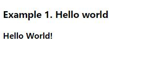

`webpack-dev-server`运行状态以及`react`最终渲染到页面的`dom`如下图所示

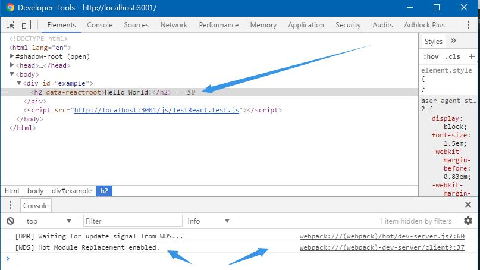

`webpack`后台热编译如图所示

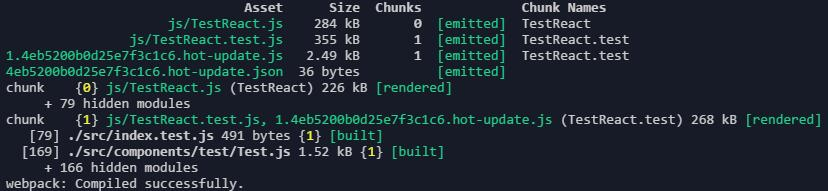

[返回](#8.1)

<a name="8.2"></a>
#### React JSX模板用法

JSX模板是react.js的基本工具,可以与js混写,即在html标签中嵌入js代码代码块,允许直接插入js变量

<a name="8.2.1"></a>
##### 在具体实现

`component/jsx/`新建`JSX.js`文件
```
$ touch Example.js
```

同上引入`react`并新建`JSX`类
```
import React,{ Component } from 'react';

class JSX extends Component {

}
```

在`render`方法里面写如下`html`标签
```
class JSX extends Component {
  render() {
    return (
      <div>
        <h3 key={`title0`}>Example 2. JSX</h3>
        <h2 key={`title3`}>Hello World!</h2>
        <p key={`p`}>This is about react JSX </p>
      </div>
    );
  }
}
```

> 请注意`render`方法不可以返回多个`html`标签,必须由父节点包裹子节点,如下代码是错误的
```
render() {
    return (
      <div title={1}></div>
      <div title={1}></div>
      <div title={1}></div>
    );
  }
```

在`JSX`模板加入`js`变量`value`
```
class JSX extends Component {
  render() {
    const value = 'This is a js value';
    return (
      <div>
        <span>Example 2</span>
        <h2>Hello World!</h2>
        <p>This is about react JSX </p>
        value:{value}
      </div>
    );
  }
}
```

如果变量是数组,则会遍历数组然后均显示出来,加入number数组`array`变量和`DOM`数组`arrDOM`变量
```
class JSX extends Component {
  render() {
    const value = 'This is a js value';
    const array = [1, 2, 3, 4];
    const arrDOM = [
      <h4 key={`title1`}>Hello JSX!</h4>,
      <h5 key={`title2`}>React is awesome</h5>,
    ];
    return (
      <div>
      <h3 key={`title0`}>Example 2. JSX</h3>
        <h2 key={`title3`}>Hello World!</h2>
        <p key={`p`}>This is about react JSX </p>
        value:{value}
        <p key={`content`}>This is a number array: {`[${array.join(',')}]`}</p>
        <br key={`br`}/>
        This is DOM array:
        {arrDOM}
      </div>
    );
  }
}
```

> 在这里使用了`ES6`语法中的模板字符串,用法如下
> 上面的字符串拼接代码在`ES5`中可以这样写
```
'[' + array.join(',') + ']';
```
> 在`ES6`中使用两个反引号\` \`将字符串内容包裹起来,同时使用`${ }`包裹`js`表达式,例如
```
var a = 17.5;
var b = 9;
console.log(`a*b=${a*b} a+b=${a+b} a/b=${a/b}`);

// a*b=157.5 a+b=26.5 a/b=1.9444444444444444
```

导出组件
```
export default JSX;
```

渲染至页面
```
// src/index.test.js

import React from 'react';
import ReactDOM from 'react-dom';
import JSX from './components/jsx/JSX';

// ...

ReactDOM.render(
  <JSX />,
  document.getElementById('example2')
);
```

```
<!--  example/index.html -->

<!DOCTYPE html>
<html lang="en">

<head>
    <meta charset="UTF-8">
    <title>Test react</title>
    <meta name="description" content="Test react" />
    <script src="https://npmcdn.com/react@15.3.1/dist/react.js"></script>
  <script src="https://npmcdn.com/react-dom@15.3.1/dist/react-dom.js"></script>
</head>

<body>
    <div id="example1" ></div>
    <br />
    <div id="example2" ></div>
    <script src="http://localhost:3001/js/TestReact.test.js"></script>
    
</body>
</html>
```

效果如下

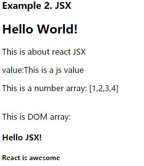

[返回](#8.2)

<a name="8.3"></a>
#### 组件属性:props用法

在`component/props`目录中新建`Props.js`文件,并定义组件,添加构造方法来继承`React.Component`父类`this`对象包括`this.props`属性
```
import React,{ Component } from 'react';

class Props extends Component {
  constructor(props) {
    super(props);
  }

  render() {
  }
}

export default Props;
```

在`render`方法中对`props`按如下方式处理,请注意react中封装了html标签的基本属性,例如`onClick`,`type`,`title`等,像标签的`class`属性即为`className`,即`class`作为关键字不可以作为组件属性名使用
```
render() {
    const props = this.props;
    return (
      <div>
        <div>
        <h3 key={`title0`}>Example 3. Props</h3>
        <h4 key={`title1`} className = {props.className}>The className is:{props.className}</h4>
      </div>
    );
  }
```

在使用`ReactDOM.render`渲染组件的时候可以自行配置`props`,即组件对外提供`API`实现一系列的操作,在这里定义`className` props属性为`test`
```
import React from 'react';
import ReactDOM from 'react-dom';

// ...

import Props from './components/props/Props';

// ...

ReactDOM.render(
  <Props className = {'test'}/>,
  document.getElementById('example3')
);
```

```
<!--  example/index.html -->

<!DOCTYPE html>
<html lang="en">

<head>
    <meta charset="UTF-8">
    <title>Test react</title>
    <meta name="description" content="Test react" />
    <script src="https://npmcdn.com/react@15.3.1/dist/react.js"></script>
  <script src="https://npmcdn.com/react-dom@15.3.1/dist/react-dom.js"></script>
</head>

<body>
    <!-- ...components -->
    <br />
    <div id="example3" ></div>
    <script src="http://localhost:3001/js/TestReact.test.js"></script>
    
</body>
</html>
```

页面最终效果

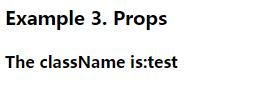

[返回](#8.3)

<a name="8.3.1"></a>
##### `this.props.children`属性

`this.props.children`它表示组件的所有子节点,可以使用React.Children.map遍历子节点,在回调函数中返回结果集
```
import React,{ Component } from 'react';

class Props extends Component {
  constructor(props) {
    super(props);
  }

  render() {
    const props = this.props;
    return (
      <div>
        <h3 key={`title0`}>Example 3. Props</h3>
        <h4 key={`title1`} className = {props.className}>The className is:{props.className}</h4>
        <ul key={`content`}>
          {
            React.Children.map(props.children, (child, i) => (<li key={i}>{child}</li>))
          }
        </ul>
      </div>
    );
  }
}

export default Props;
```

> 这里需要注意,`this.props.children` 的值有三种可能：如果当前组件没有子节点,它就是 `undefined`;如果有一个子节点,数据类型是 object;如果有多个子节点,数据类型就是 `array`.所以,处理 `this.props.children` 的时候要小心

`ReactDOM.render`渲染组件,即是将子组件嵌入`Props`组件中
```
// index.test.js

ReactDOM.render(
  <Props className = {'test'}>
    <li key={0}>test1</li>
    <li key={1}>test2</li>
    <li key={2}>test3</li>
    <li key={3}>test4</li>
  </Props>,
  document.getElementById('example3')
);
```

页面最终效果

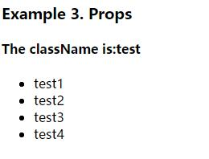

[返回](#8.3)

<a name="8.4"></a>
#### 组件类的`PropTypes`属性

在组件的属性(`props`)可以接受任意类型值,字符串、对象、函数等,所以需要做约束并且可以赋默认值,如果类型不符合`PropTypes`已设定好的类型则报错

在`components/props`目录下新建`PropTypes.js`,并定义`PropTypes`组件类,继承`React.Component`父类,定义构造方法,继承`this`对象,实现上面`Props`示例组件中的render方法
```
import React, { Component } from 'react';

class PropTypes extends Component {
  constructor(props) {
    super(props);
  }

  render() {
    const props = this.props;
    return (
      <div>
        <span>Example 3.1</span>
        <h3 className = {props.className}>The className is:{props.className}</h3>
        The test props is {props.test}
        <br />
        The num props is {props.num}
        <ul>
          {
            React.Children.map(props.children, (child) => (<li>{child}</li>))
          }
        </ul>
      </div>
    );
  }
}

export default PropTypes;
```

定义`PropTypes`属性
```
PropTypes.PropTypes = {
  test: React.PropTypes.string, // 规定test属性类型为string
  num: React.PropTypes.number, // 规定num属性类型为number
};
```

定义`PropTypes` 默认值
```
PropTypes.defaultProps = {
  test: 'test',
  num: 1,
};
```

渲染组件
```
ReactDOM.render(
  <PropTypes className = {'test'} num={2} />,
  document.getElementById('example3_1')
);
```

页面最终效果

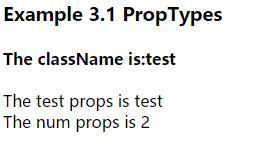

> 请注意`num`默认值被重新赋值为2

[返回](#8.4)

<a name="8.5"></a>
#### 获取真实的`DOM`节点

上面所有组件均不是真实的DOM,是存在于内存中的虚拟`DOM`,只有真正插入至文档中才是真实的`DOM`.`react`的核心原理是所有的`DOM`结构变化均是内存中虚拟`DOM`结构变化,然后将实际变动结构渲染至文档真实`DOM`结构中,此时如果需要获取真实的`DOM`结构,需要使用`ref`属性

定义`RealDOM` `react`组件类,并定义`ref`属性为`test`如下所示
```
import React, { Component } from 'react';

class RealDOM extends Component {
  constructor(props) {
    super(props);
  }

  render() {
    return (
      <div>
        <span>Example 4</span>
        <h3 ref={`test`}>This is real DOM </h3>
      </div>
    );
  }
}

export default RealDOM;
```

在这里,定义点击事件钩子函数获取`ref`属性为的`test`的真实`DOM`结构的`innerHTML`值(`This is real DOM `),如下所示
```
// 定义钩子函数_handleClick,并绑定
class RealDOM extends Component {
  constructor(props) {
    super(props);

    [
      'render',
      '_handleClick',
    ].forEach((method) => this[method] = this[method].bind(this));
  }

  _handleClick() {
    alert(`The content of the real DOM is: \n${this.refs.test.innerHTML}`);
  }

  render() {
    // ...
  }
}
```

```
// 定义button按钮设置onClick事件

render() {
    return (
      <div>
        <h3 key={`title0`}>Example 4. Real DOM</h3>
        <h4 key={`title1`} ref={`test`}>This is real DOM </h4>
        <button key={`title2`} onClick={this._handleClick}>button</button>
      </div>
    );
  }
```

> 在这里`h3`的`ref`值是`test`,用`this.refs`就能取得真实的`DOM`结构,但是请注意根据以上逻辑,只有当虚拟`DOM`真正插入文档中时才能获取,即可通过事件获取

页面最终效果

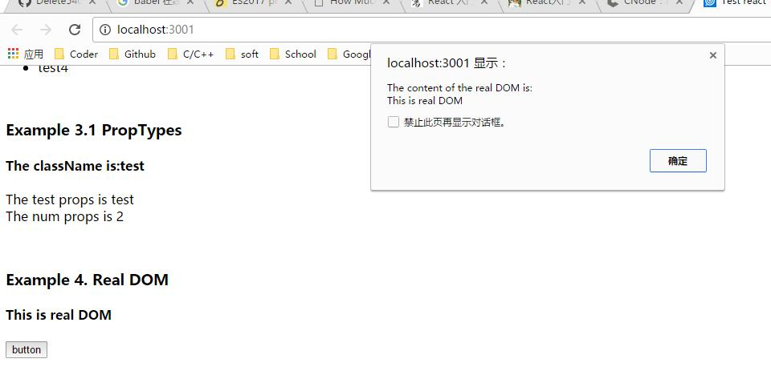

[返回](#8.5)

<a name="8.6"></a>
#### 状态

`react`核心思想之一就是监听状态变化(即状态机)引发组件重新渲染,且根据需要设置初始状态

即使用`this.state`,`this.state`初始值是一个空对象,即可以给`this.state`赋任意属性,并设置初始状态,使用`this.setState()`方法改变状态
```
// 设置初始状态
this.state.isDone = false 

// ...

// 更改状态
this.setState({
  isDone:false,
});
```

下面用一个组件例子说明,定义`State`组件类
```
class State extends Component {
  constructor(props) {
    super(props);
  }

  render() {
    const _state = this.state;
    return (
      
    );
  }
}

State.propTypes = {
};

State.defaultProps = {
};

export default State;
```

加入`button`标签,通过点击事件改变组件状态
```
return (
      <div>
        <h3 key={`title0`}>Example 5. State</h3>
        <br key={`title1`}/>
        The state is: {_state.text}
        <br key={`title2`} />
        <button key={`title3`} onClick = {this._handleClick}>button</button>
      </div>
    );
```

定义`props`属性,`text`,并设置默认值为`start`,同时在构造函数中初始化状态
```
class State extends Component {
  constructor(props) {
    super(props);

    this.state = {
      text: props.text,
    };
  }

  render() {
    const _state = this.state;
    return (
      <div>
        <h3 key={`title0`}>Example 5. State</h3>
        <br key={`title1`}/>
        The state is: {_state.text}
        <br key={`title2`} />
        <button>button</button>
      </div>
    );
  }
}

State.propTypes = {
  text: React.PropTypes.string,
};

State.defaultProps = {
  text: 'start',
};

export default State;
```

定义点击事件钩子函数,用于改变状态
```
_handleClick() {
    let state = '';
    if (this.state.text === 'start') {
      state = 'end';
    } else {
      state = 'start';
    }

    this.setState({
      text: state,
    }, () => {
      console.log(this.state.text);
      document.getElementById('contentId').append(`${this.state.text}\n`);
    });
  }
```

在构造函数中为钩子函数绑定`this`对象
```
[
  'render',
  '_handleClick',
].forEach((method) => this[method] = this[method].bind(this));
```

给按钮`onClick`绑定钩子函数
```
<button key={`title3`} onClick = {this._handleClick}>button</button>
```

将组件渲染至页面
```
ReactDOM.render(
  <State />,
  document.getElementById('example5')
);
```

最终效果如下

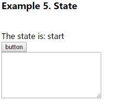

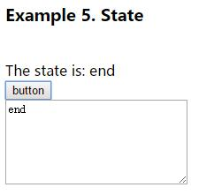

[返回](#8.6)

<a name="8.7"></a>
#### 组件生命周期

根据`react`原理,每个组件均有生命周期.组件生命周期包括如下三种状态
```
* Mounting：已插入真实 DOM
* Updating：正在被重新渲染
* Unmounting：已移出真实 DOM
```

同时对应这几个状态分别有如下几种方法
```
componentWillMount() // 即将插入真实`DOM`之前
componentDidMount()  // 完成插入真实`DOM`
componentWillUpdate(object nextProps, object nextState) // 组件即将被渲染之前
componentDidUpdate(object prevProps, object prevState)  // 组件完成渲染
componentWillUnmount()  // 移除真实`DOM`
```

还有如下两种方法
```
componentWillReceiveProps(object nextProps)  // 已加载组件收到新的参数时调用
shouldComponentUpdate(object nextProps, object nextState) // 组件判断是否重新渲染时调用
```

<a name="8.7.1"></a>
##### componentWillMount用法

在插入真实`DOM`之前执行,并且允许使用`setState`方法改变状态,允许最后一次修改状态,且`不会`发生重新渲染

示例如下

定义`ComponentWillMount`组件类,定义构造方法,声明`componentWillMount`方法,设置初始状态`test`为`start`
```
class ComponentWillMount extends Component {
  constructor(props) {
    super(props);
  }

  render() {
  
  }
}

export default ComponentWillMount;
```

实现`componentWillMount`方法,打印初始状态,然后再改变状态,将状态`test`改为`end`
```
componentWillMount() {
   console.log(`[Method] componentWillMount\n[State test] ${this.state.test}`);
   document.getElementById('contentId_2')
           .append(`[Method] componentWillMount\n[State test] ${this.state.test}\n`);
   this.setState({
     test: 'end',
   });
 }
```

实现`render`方法,打印状态
```
render() {
    console.log(`[Method] render\n[State test] ${this.state.test}`);
    document.getElementById('contentId_2')
            .append(`[Method] render\n[State test] ${this.state.test}`);
    return (
      <div>
        <h3 key={`title0`}>Example 6.1 componentWillMount</h3>
        <br />
        Render this component,state:{this.state.test}
      </div>
    );
  }
```

将组件渲染至页面
```
// index.test.html 

ReactDOM.render(
  <ComponentWillMount />,
  document.getElementById('example6_1')
);
```

效果如下

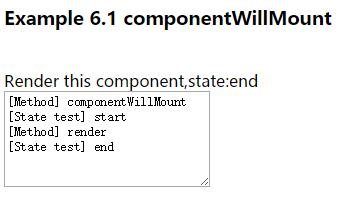

[返回](#8.7)

<a name="8.7.2"></a>
##### componentDidMount用法

当组件完成插入真实`DOM`后执行,请注意此处不能使用'this.setState'方法,否则会陷入死循环,组件会被不停地改变状态刷新组件

示例如下

定义`ComponentDidMount`组件类,初始化状态`this.state.test`为'start',实现`ComponentDidMount`方法和`render`方法,并打印前后状态
```
class ComponentDidMount extends Component {
  constructor(props) {
    super(props);

    this.state = {
      test: 'start',
    };
  }

  componentDidMount() {
    console.log(`[Method] componentDidMount\n[State test] ${this.state.test}`);
    document.getElementById('contentId_3')
           .append(`[Method] componentDidMount\n[State test] ${this.state.test}\n`);
  }

  render() {
    console.log(`[Method] render\n[State test] ${this.state.test}`);
    document.getElementById('contentId_3')
           .append(`[Method] render\n[State test] ${this.state.test}\n`);
    return (
      <div>
        <h3 key={`title0`}>Example 6.2 componentDidMount</h3>
        <br />
        The state is: {this.state.test}
      </div>
    );
  }

}
```

将组件渲染至页面
```
ReactDOM.render(
  <ComponentDidMount />,
  document.getElementById('example6_2')
);
```

效果如下

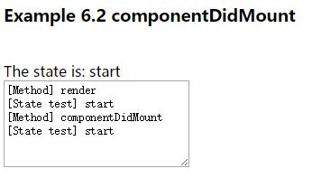

[返回](#8.7)
 
<a name="8.7.3"></a> 
##### componentWillUpdate

组件即将被渲染之前执行,可以通过事件触发状态改变,刷新组件

示例如下

定义`ComponentWillUpdate`组件类,定义构造方法,声明`ComponentWillUpdate`方法,设置初始状态`test`为`start`,实现`ComponentDidMount`方法和`render`方法,并打印前后状态
```
class ComponentWillUpdate extends Component {
  constructor(props) {
    super(props);

    this.state = {
      test: 'start',
    };
  }

  componentWillUpdate() {
    console.log(`[Method] componentWillUpdate\n[State test] ${this.state.test}`);
  }

  render() {
    console.log(`[Method] render\n[State test] ${this.state.test}`);
    return (
      <div>
        <span key={`title0`}>Example 6.4 componentWillUpdate</span>
        <br />
        Render this component,state:{this.state.test}
        <button key={`title1`}>updateComponent</button>
      </div>
    );
  }
}
```

实现点击事件钩子函数,并给按钮绑定钩子函数
```
class ComponentWillUpdate extends Component {
  constructor(props) {
    super(props);

    this.state = {
      test: 'start',
    };

    [
      'render',
      '_handleClick',
    ].forEach((method) => this[method] = this[method].bind(this));
  }

  componentWillUpdate() {
    console.log(`[Method] componentWillUpdate\n[State test] ${this.state.test}`);
    document.getElementById('contentId_4')
           .append(`[Method] componentWillUpdate\n[State test] ${this.state.test}\n`);
  }

  _handleClick() {
    console.log(`[Method] _handleClick \n[State test] ${this.state.test}`);
    document.getElementById('contentId_4')
           .append(`[Method] _handleClick\n[State test] ${this.state.test}\n`);
    this.setState({
      test: 'end',
    }, () => {
      console.log(`[Method] _handleClick callback \n[State test] ${this.state.test}`);
      document.getElementById('contentId_4')
           .append(`[Method] _handleClick callback\n[State test] ${this.state.test}\n`);
    });
  }

  render() {
    console.log(`[Method] render\n[State test] ${this.state.test}`);
    document.getElementById('contentId_4')
           .append(`[Method] render\n[State test] ${this.state.test}\n`);
    return (
      <div>
        <h3 key={`title0`}>Example 6.3 componentWillUpdate</h3>
        <br />
        Render this component,state:{this.state.test}
        <br />
        <button key={`title1`} onClick={this._handleClick}>updateComponent</button>
      </div>
    );
  }
}
```

渲染组件
```
ReactDOM.render(
  <ComponentWillUpdate />,
  document.getElementById('example6_3')
);
```

效果如下

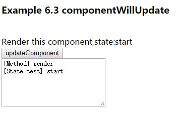

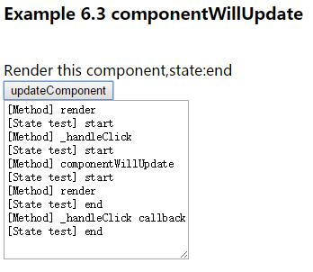

[返回](#8.7)

<a name="8.7.4"></a>
##### componentDidUpdate用法

组件完成渲染后执行

定义`ComponentDidUpdate`组件类,按照上面的`ComponentWillUpdate`组件实现类似的方法和配置
```
class ComponentDidUpdate extends Component {
  constructor(props) {
    super(props);

    this.state = {
      test: 'start',
    };

    [
      'render',
      '_handleClick',
    ].forEach((method) => this[method] = this[method].bind(this));
  }

  componentDidUpdate() {
    console.log(`[Method] componentDidUpdate\n[State test] ${this.state.test}`);
    document.getElementById('contentId_5')
           .append(`[Method] componentDidUpdate\n[State test] ${this.state.test}\n`);
  }

  _handleClick() {
    console.log(`[Method] _handleClick \n[State test] ${this.state.test}`);
    document.getElementById('contentId_5')
           .append(`[Method] _handleClick\n[State test] ${this.state.test}\n`);
    this.setState({
      test: 'end',
    }, () => {
      console.log(`[Method] _handleClick callback \n[State test] ${this.state.test}`);
      document.getElementById('contentId_5')
           .append(`[Method] _handleClick callback\n[State test] ${this.state.test}\n`);
    });
  }

  render() {
    console.log(`[Method] render\n[State test] ${this.state.test}`);
    document.getElementById('contentId_5')
           .append(`[Method] render\n[State test] ${this.state.test}\n`);
    return (
      <div>
        <h3 key={`title0`}>Example 6.4 componentDidUpdate</h3>
        <br />
        Render this component,state:{this.state.test}
        <br />
        <button key={`title1`} onClick={this._handleClick}>updateComponent</button>
      </div>
    );
  }
}
```

效果如下

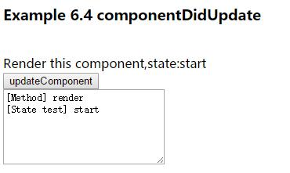

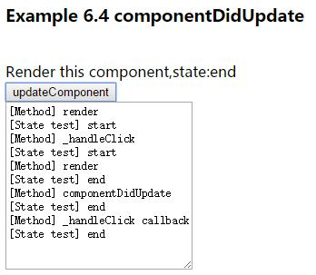

[返回](#8.7)

<a name="8.7.5"></a>
##### componentWillUnmount用法

移除真实`DOM`时执行

定义`ComponentWillUnmount`组件类,用`ReactDOM.unmountComponentAtNode`移除组件
```
class ComponentWillUnmount extends Component {
  constructor(props) {
    super(props);

    this.state = {
      test: 'start',
    };
  }

  componentWillUnmount() {
    console.log(`[Method] componentWillUnmount\n The component is removed!`);
    document.getElementById('contentId_6')
           .append(`[Method] componentWillUnmount\n The component is removed!`);
  }

  render() {
    console.log(`[Method] render\n The component is rendered!`);
    document.getElementById('contentId_6')
           .append(`[Method] render\n The component is rendered!\n`);
    return (
      <div>
        <h3 key={`title0`}>Example 6.5 componentWillUnmount</h3>
        <br />
        Render this component,state:{this.state.test}
        <br />
      </div>
    );
  }
}
```

```
ReactDOM.render(
  <ComponentWillUnmount />,
  document.getElementById('example6_5')
);

ReactDOM.unmountComponentAtNode(document.getElementById('example6_5'));
```

效果如下

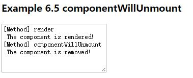

[返回](#8.7)

<a name="8.7.6"></a>
##### componentWillReceiveProps用法

已加载组件收到新的`props`参数时执行

示例如下

定义`ComponentWillReceiveProps`组件类,并定义`props.test`属性,初始化`state`,并将`props.test`传递给`this.state.test`,通过点击事件触发状态改变,同时需要外部调用`ComponentWillReceiveProps`组件类,并且将点击事件传递至`ComponentWillReceiveProps`组件类,且使该组件接收到新的`props`
```
class ComponentWillReceiveProps extends Component {
  constructor(props) {
    super(props);

    // 初始化test
    let test = 'start';

    // 通过props初始化test
    if ('test'in props) {
      test = props.test;
    }

    // 初始化state
    this.state = {
      test,
    };

    // 绑定this对象
    [
      'render',
      '_handleClick',
    ].forEach((method) => this[method] = this[method].bind(this));
  }

  componentWillReceiveProps(nextProps) {
    if ('test' in nextProps) {
      document.getElementById('contentId_7')
           .append(`[Method] componentWillReceiveProps\n[State test] ${this.state.test}\n`);
      this.setState({
        test: nextProps.test,
      });
    }
  }

  // 定义钩子函数,由外部传递事件函数
  _handleClick() {
    document.getElementById('contentId_7')
           .append(`[Method] _handleClick\n[State test] ${this.state.test}\n`);
    this.props._handleClick();
  }

  render() {
    return (
      <div>
        <span key={`title0`}>Example 6.6 componentWillReceiveProps</span>
        <br />
        <button onClick = {this._handleClick}>new props</button>
        <br />
        The state is: {this.state.test}
      </div>
    );
  }
}
// 初始化propTypes
ComponentWillReceiveProps.propTypes = {
  test: React.PropTypes.string,
  _handleClick: React.PropTypes.func,
};

// 函数类型的propTypes必须有默认值,这里赋空函数
ComponentWillReceiveProps.defaultProps = {
  _handleClick: () => (null),
};
```

```
// index.test.js

class Test extends Component {

  constructor(props) {
    super(props);

    // 初始化状态
    this.state = {
      test: 'start',
    };

    [
      'render',
      'handleClick',
    ].forEach((method) => this[method] = this[method].bind(this));
  }

  // 改变状态钩子事件函数
  handleClick() {
    this.setState({
      test: 'end',
    });
  }

  // 调用ComponentWillReceiveProps组件并设置test/_handleClick属性
  render() {
    return (
      <ComponentWillReceiveProps test = {this.state.test} _handleClick = {this.handleClick} /> 
    );
  }
}

// 渲染组件
ReactDOM.render(
  <Test />,
  document.getElementById('example6_6')
);
```

> 请注意此处使用了`react`组件复用性的特点

效果如下

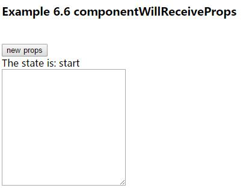

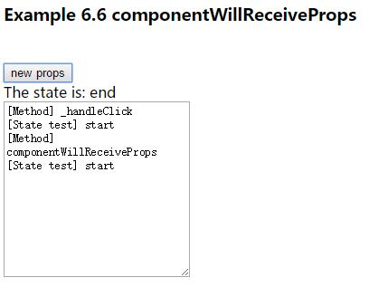 

[返回](#8.7)

<a name="8.7.7"></a>
##### ShouldComponentUpdate用法

组件判断是否重新渲染时调用,即接收到新的`props`或`state`时执行此方法

示例如下

定义`ShouldComponentUpdate`,初始化状态,并用事件触发改变状态,在`shouldComponentUpdate`方法和`render`中打印状态
```
class ShouldComponentUpdate extends Component {
  constructor(props) {
    super(props);

    this.state = {
      test: 'start',
    };

    [
      'render',
      '_handleClick',
    ].forEach((method) => this[method] = this[method].bind(this));
  }

  shouldComponentUpdate(nextprops, nextstate) {
    console.log(`[Method] shouldComponentUpdate\n[State test] ${nextstate.test}`);
    document.getElementById('contentId_8')
           .append(`[Method] shouldComponentUpdate\n[State test] ${this.state.test}\n`);
    return false;
  }

  _handleClick() {
    console.log(`[Method] _handleClick \n[State test] ${this.state.test}`);
    document.getElementById('contentId_8')
           .append(`[Method] _handleClick\n[State test] ${this.state.test}\n`);
    this.setState({
      test: 'end',
    }, () => {
      console.log(`[Method] _handleClick callback \n[State test] ${this.state.test}`);
      document.getElementById('contentId_8')
           .append(`[Method] _handleClick callback \n[State test] ${this.state.test}\n`);
    });
  }

  render() {
    console.log(`[Method] render\n[State test] ${this.state.test}`);
    document.getElementById('contentId_8')
           .append(`[Method] render \n[State test] ${this.state.test}\n`);
    return (
      <div>
        <h3 key={`title0`}>Example 6.7 shouldComponentUpdate</h3>
        <br />
        Render this component,state:{this.state.test}
        <br />
        <button key={`title1`} onClick={this._handleClick}>updateComponent</button>
      </div>
    );
  }
}
```

效果如下

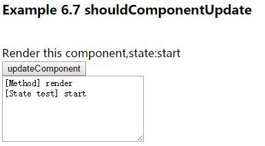

请注意此方法要设置返回值,否则会提示如下警告
```
Warning: ShouldComponentUpdate.shouldComponentUpdate(): Returned undefined instead of a boolean value. Make sure to return true or false.
```

如果返回值是`false`,那么下一个`render`不会执行

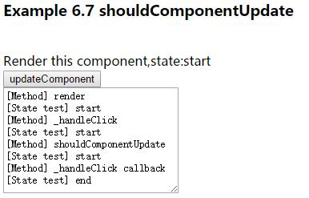

[返回](#8.7)

[返回目录](#0)

## 参考

* [React英文官网](https://facebook.github.io/react/)
* [React中文官网](http://reactjs.cn/react/docs/getting-started-zh-CN.html)
* [React Github](https://github.com/facebook/react)
* [ECMAScript 6 入门](http://es6.ruanyifeng.com/)
* [ECMAScript 2015](http://www.ecma-international.org/ecma-262/6.0/)
* [Babel](https://babeljs.io)
* [Babel 中文](http://babeljs.cn/)
* [Babel 在线工具](https://babeljs.io/repl/)
* [ESLint](http://eslint.org/)
* [ESLint Github](https://github.com/eslint/eslint)
* [ESLint 中文](http://eslint.cn)
* [Webpack](https://webpack.github.io/)
* [Webpack Github](https://github.com/webpack/webpack)
* [CNode 社区](https://cnodejs.org)
* [react-component](https://github.com/react-component)
* [ant design](https://ant.design/)
* [airbnb javascript](https://github.com/airbnb/javascript)
