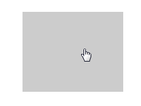

## MD wave ripple

Material design wave ripple(水墨) 效果实现
##### PS:参考了Materialize 的waves.js的实现代码
  
  Github:https://github.com/Dogfalo/materialize

### Install & run 安装运行
 ```
 $ npm install

 $ npm run build

 $ npm run serve
 ```



### How to do this 实现原理

如图所示:


##### Get the relative position 计算相对位置坐标

 ```
 let relativeX = event.pageX - (element.left + window.pageXOffset - document.clientLeft);

 let relativeY = event.pageY - (element.top + window.pageYOffset - document.clientTop);
 ```

##### Set element style 设置元素样式

 * calculate scale 计算scale值

 ```
 let scale = 'scale(' + ((element.clientWidth / 100) * 10) + ')';
 ```
 
 * set transform/transition-duration/transition-timing-function
   * PS: use `cubic-bezier(贝塞尔曲线)` of transition-timing-function

##### Event 事件流程

 * mousedown/ontouchstart --> show the ripple;
 * mouseup/mouseleave/touchend/touchcancel -->hide the ripple
   * Set setTimeout to delay hide the ripple       