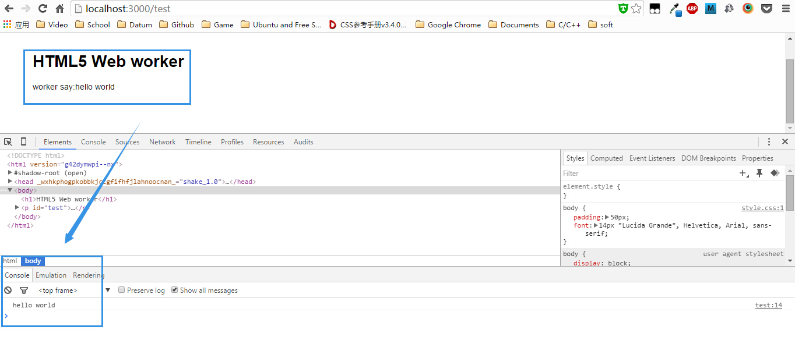
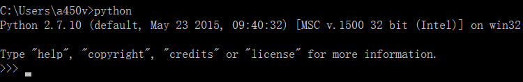
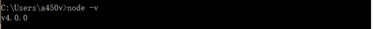
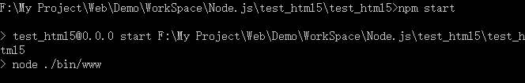
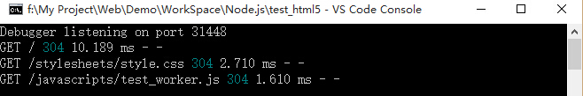

HTML5 Web worker 学习
====


<br/>

* Create by Jun
* 19/10/2015

<br/>


##<a id="md_0" name="md_0"></a>目录##

* [关于Web worker](#md_1)
* [示例程序](#md_2)
  + [说明](#md_2_1)
  + [准备工作](#md_2_2)
    - [安装Python](#md_2_2_1)
    - [安装Node.js](#md_2_2_2)
    - [安装Express.js](#md_2_2_3)
    - [安装和部署示例程序](#md_2_2_4)
    - [运行示例程序](#md_2_2_5)


[返回顶部](#md_0)

#<a id="md_1" name="md_1"></a>关于Web worker#
Web Workers 是 HTML5 提供的一个javascript多线程解决方案，我们可以将一些大计算量的代码交由web Worker运行而不冻结用户界面。

##<a id="md_1_1" name="md_1_1"></a>使用Web worker##

Web Worker的基本原理就是在当前javascript的主线程中，使用Worker类加载一个javascript文件来开辟一个新的线程，起到互不阻塞执行的效果，并且提供主线程和新线程之间数据交换的接口：postMessage，onmessage。

* 在学习过程中起初我以为可以用静态html页面进行实验，但是Chome调试工具报错提示需要运行在服务器上。所以可以使用Java/PHP/ASP.NET/Node.js/Python等做服务端，在学习过程中我用的是Node.js，更简单快捷，毕竟Node.js也可以用于调试和编译JavaScript。而且，在HTML5中JavaScript必不可少。详情请见[示例程序](#md_2)。

###测试程序清单如下：

* JavaScript文件路径

>/test_html5/public/javascripts/test_worker.js

<br/>
test_worker.js
```
onmessage =function (evt){
var d = evt.data;  
//通过evt.data获得发送来的数据

postMessage( d ); 
//将获取到的数据发送会主线程
}
```
<br/>

* html文件路径

>/test_html5/views/test.html   //访问：`http://localhost:3000/test`

<br/>
test.html

```
<!DOCTYPE html>
<html>
  <head>
    <title><%= title %></title>
    <link rel='stylesheet' href='/stylesheets/style.css' />
    <script type="text/javascript">
//WEB页主线程
var worker =new Worker("/javascripts/test_worker.js"); 
//创建一个Worker对象并向它传递将在新线程中执行的脚本的URL
 worker.postMessage("hello world");     
//向worker发送数据
 worker.onmessage =function(evt){     
//接收worker传过来的数据函数
   console.log(evt.data);              
//输出worker发送来的数据
var test=document.getElementById('test');
test.innerHTML='worker say:'+evt.data;
 }
 </script>
  </head>
  <body>
    <h1><%= title %></h1>
    <p id="test"></p>
    
  </body>
</html>

```

###运行程序

* 先启动[示例程序](#md_2)
* 在浏览器中输入：

<br/>

>http://localhost:3000/test

<br/>

###测试程序运行结果



* Web页面主线程

  1. 通过 worker = new Worker( url ) 加载一个JavaScript文件来创建一个worker，
  同时返回一个worker实例。
  2. 通过worker.postMessage( data ) 方法来向worker发送数据。
  3. 绑定worker.onmessage方法来接收worker发送过来的数据。
  4. 可以使用 worker.terminate() 来终止一个worker的执行。
  
* worker线程：

  1.  通过postMessage( data ) 方法来向主线程发送数据。
  2.  绑定onmessage方法来接收主线程发送过来的数据。

<br/>
  
[返回顶部](#md_0)
  
#<a id="md_2" name="md_2"></a>示例程序#

##<a id="md_2_1" name="md_2_1"></a>说明##

本示例程序是基于Node.js，使用基于Node.js的JavaScript Web框架：Express.js 4.x，详情请见目录：

>/test_html5/package.json  //Node.js express 项目配置文件


关于Node.js[点击这里](https://nodejs.org),CNode社区[点击这里](https://cnodejs.org/)，关于Express[点击这里](http://expressjs.com/)

##<a id="md_2_2" name="md_2_2"></a>准备工作##

###<a id="md_2_2_1" name="md_2_2_1"></a>安装Python###

Node.js需要Python支持，所以在安装Node.js之前，请先安装并配置Python，Python[下载地址](https://www.python.org/downloads/)
* PS:请安装Python 2.x版本，目前Node.js是支持Python 2.x。
* Python支持Windows/Linux/Unix.
* 检验Python是否安装并配置完成，打开命令窗口：


>$ python


如图所示：



###<a id="md_2_2_2" name="md_2_2_2"></a>安装Node.js###

Node.js[下载地址](https://nodejs.org/en/download/)
* Node.js支持Windows/Linux/Unix
* 检验Node.js是否安装并配置完成：


>$ node -v





>$ npm -v


###<a id="md_2_2_3" name="md_2_2_3"></a>安装Express.js###

安装Express.js至系统变量


>$ npm install express -g


安装完毕检查是否安装成功：


>$ express -V   //注意大小写


安装bower JavaScript库管理工具

>$ npm install bower -g

检验是否安装成功

>$ bower -v


###<a id="md_2_2_4" name="md_2_2_4"></a>安装和部署示例程序###

命令窗口执行命令：


>$ cd test_html5


安装package.json和bower.json清单里的程序依赖包


>$ npm install
>&nbsp;
>$ bower install

###<a id="md_2_2_5" name="md_2_2_5"></a>运行示例程序###

命令窗口执行命令：


>$ npm start






[返回顶部](#md_0)
